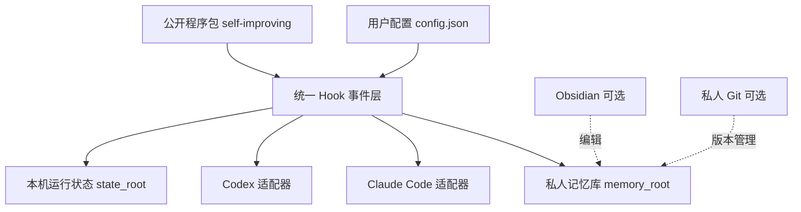
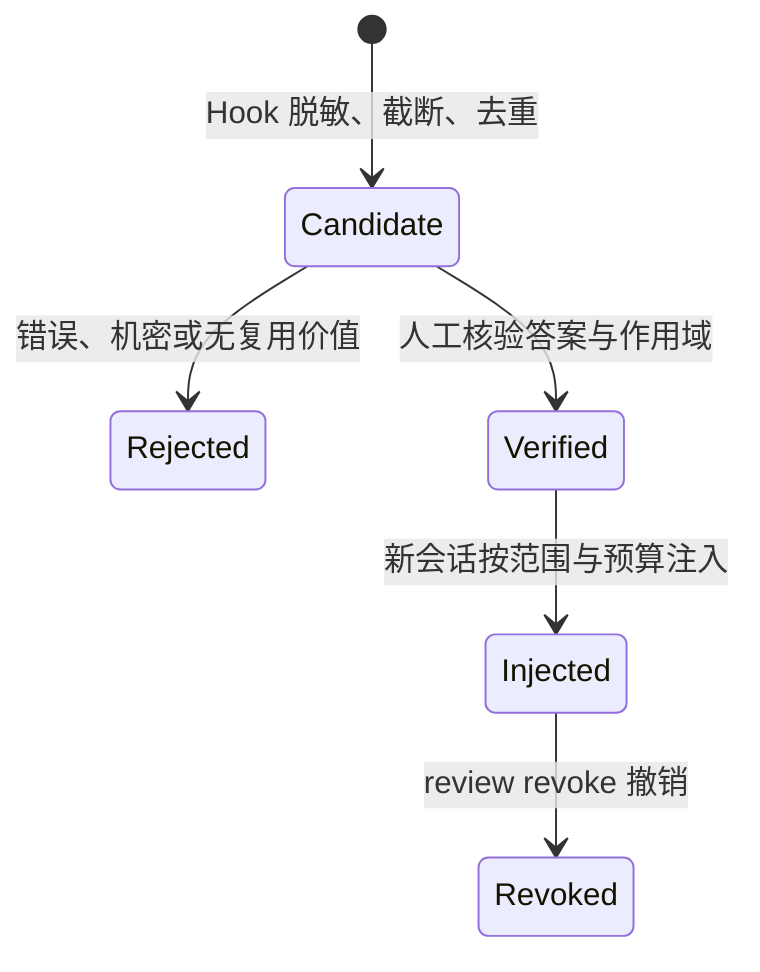

# Doraemon 跨 Agent 自我进化记忆系统架构与设计

> V1.0.0 · 2026-07-12 · 首版：从私人架构档案拆分出的公开架构说明，适用 self-improving 2.5.0。

本文解释 self-improving 的整体设计：系统分成哪几层、Hook 怎样接入 Claude Code 与 Codex、一条纠错从捕获到生效要过哪些关卡，以及关键方案为什么这样取舍。安装与日常操作请读 [五分钟从零开始](quickstart-zh.md)，本文不重复命令细节。

> 事实优先级：真实运行结果 > 当前配置和代码 > 本文。规划不写成已上线。

## 1. 四层分离

第一条设计决策：程序与数据彻底分开。程序可以公开、升级、回滚；用户数据永远留在用户自己选择的目录。



| 层 | 位置 | 内容 |
|---|---|---|
| 公开程序 | 本仓库 `self-improving/` | 代码、模板、安装器、测试、文档；不含任何用户数据 |
| 用户配置 | 默认 `~/.config/self-improving/config.json`，可用 `SELF_IMPROVING_CONFIG` 覆盖 | 记忆库位置、启用的 Agent、捕获与注入开关 |
| 私人记忆 | 配置中的 `memory_root`，位置由用户决定 | 核心记忆、纠错流水、候选箱、审批账本 |
| 运行状态 | 配置中的 `state_root` | 备份、迁移清单、文件锁 |

私人记忆可以放普通文件夹、Obsidian Vault 或私人 Git 仓库——它们只是装数据的盒子，都不是安装前提。

## 2. 目标与非目标

目标：

1. Claude Code 与 Codex 每次新会话都从同一个 `memory.md` 读取最小共享核心。
2. 两个平台的明确纠错都由 Hook 自动进入未验证候选箱，不靠 Agent 记得执行命令。
3. 候选必须经人工审核并明确选择全局/项目范围，才能进入机器可验证审批账本；历史纠错流水不会因升级突然变成指令。
4. 用户可配置、关闭持久化、升级、迁移和卸载；默认保留私人数据。
5. 陌生用户从 GitHub 下载后，不需要知道作者路径，也不强制安装 Obsidian。

非目标：

- 不上传私人记忆、对话、日志、凭据或 Hook 信任状态。
- 不关闭 Claude/Codex 原生私有记忆。
- 不把网页、PDF、邮件、命令输出或子 Agent 结论自动晋升成权威规则。
- 不为未经真实客户端验证的 Agent（Gemini 等）伪造适配状态。
- 不承诺 Hook 能拦截平台尚未提供事件的全部文件编辑方式。

## 3. 私人记忆库结构

初始化时程序创建的固定入口：

```text
<memory_root>/
├── memory.md                        # 每会话注入的最小核心，5–50 行
├── index.md                         # `sync` 自动生成的知识索引
├── corrections.md                   # 人类可读的纠错审计流水
├── .self-improving/
│   └── verified-corrections.jsonl  # 机器可验证的审批账本（追加式事件真身）
└── .learnings/
    ├── CORRECTIONS_INBOX.md         # 未验证纠错候选箱
    └── ERRORS.md                    # 不可信错误摘要（默认关闭集中持久化）
```

固定入口之外，用户可以按主题自建知识目录（例如领域知识、项目、创作风格）。`sync` 会把整个记忆库的 Markdown 收进 `index.md`，Agent 按需读取，不占每会话注入预算。

固定入口名不改；规范类知识文档建议在标题下用版本头 `> VX.Y.Z · YYYY-MM-DD · 本次变更一句话` 记录演进，文件名保持稳定，避免每次更新制造改名和断链。

## 4. Hook 接入

Claude Code 和 Codex 的原始 Hook JSON 先由平台适配器转换成统一事件，写入逻辑只消费统一事件，不理解各平台原始格式：

```text
platform / event / session_id / cwd / prompt / tool_name /
tool_input / tool_output / exit_status / trust_level
```

两平台都接入五类事件：

| 事件 | 行为 |
|---|---|
| `SessionStart` | 校验核心记忆的结构与预算，再按当前目录和预算注入已批准纠错；候选达阈值时附带预审提醒 |
| `UserPromptSubmit` | 明确纠错经脱敏、截断、按天去重后进入候选箱 |
| `PreToolUse` | 命中权威文件（`memory.md`、`corrections.md`、审批账本）常见写入或 Shell 批准/撤销命令时，弹权限框由用户当场批准（Claude Code 2.3.0 起，Codex 0.144+ 起） |
| `PostToolUse` | 按配置捕获命令失败；默认关闭集中错误持久化 |
| `Stop` | 候选达到提醒阈值时提示审核，不自动晋升 |

守门对整条命令做文本扫描、不解析 Shell 语法，定位是防误操作和"未经人批准的权威写入"，不是操作系统权限边界（详见[设计取舍](#8-设计取舍)第 4 条）。安装器采用"合并而非覆盖"：先备份当前配置，只移除旧版 self-improving 接线，保留其他第三方 Hook。事件与守门的完整行为见 [hooks.md](hooks.md)。

## 5. 一条纠错的生命周期



三个信任层级，写入权逐层收紧：

| 层级 | 内容 | 是否自动注入 | 写入权 |
|---|---|---|---|
| 候选层 | 用户原话、命令错误 | 否 | Hook 可写 |
| 已验证纠错层 | 审核命令写入的"正确答案 + 范围 + 时间" | 是，受范围与预算限制 | 只有审核命令 |
| 核心记忆层 | 长期稳定的偏好与原则（`memory.md`） | 是，5–50 行 | 严格人工维护 |

自动化只做到候选层：捕获、脱敏、截断、按天去重、提醒待审。晋升永远需要人批准，且批准时必须选 `global` 或 `project:/绝对路径`——"跨 Agent"只表示 Claude Code 与 Codex 共享，不表示跨项目广播。候选攒到阈值后，新会话会提示 AI 预审：Agent 逐条提炼规则草稿并给建议，用户同意后一条串联命令完成批准，客户端只弹一次权限框——判断成本压到"看一眼、点一下"，但晋升权始终在人。

审核命令与完整教程见 [quickstart-zh.md](quickstart-zh.md) 第 6 节；历史流水的显式导入见其第 11 节。

## 6. 安全边界

1. 私人数据与公开程序物理分离；程序仓库禁止出现任何用户数据。
2. 纠错和错误写入前执行常见令牌、密码、Cookie、私钥、URL 凭据脱敏。
3. 写入使用原子替换和跨平台文件锁；写后读回才算成功。
4. 权威记忆结构异常、超预算或疑似含凭据时，启动 Hook 只报警、不注入。
5. 注入受双重预算约束：`memory.md` 5–50 行且默认不超 8000 字符；已批准纠错默认注入最新 20 条、不超 4000 字符。
6. 高风险任务可临时关闭持久化，读取不受影响（见 [quickstart-zh.md](quickstart-zh.md) 第 9 节）。

## 7. 体检分层

`python3 -m self_improving doctor` 把"装了"和"真的在学"分开报告：

| 层级 | 判定 |
|---|---|
| 已安装 | 程序、配置或入口存在 |
| 已启用 | 平台配置真实引用 Hook |
| 当前版本事件契约 | 新会话或脱敏真实结构回放已触发当前版本适配器 |
| 数据健康 | 核心预算、敏感信息、索引、链接通过 |
| 学习闭环 | 待审核数、机器可验证数、当前目录适用数、实际可注入数分层报告 |

索引和断链属于提醒；缺配置、缺核心记忆、Hook 未接线属于失败。任何失败都不能宣称"系统全部正常"。

## 8. 设计取舍

这些方案被认真考虑过、然后被放弃或收紧。记录在此，避免后来者重新踩坑。

1. **放弃"同一说法出现三次就自动晋升"。** 重复只能证明内容多次出现，不能证明它正确；外部内容还可能借重复进行指令污染。晋升权保留给人，自动化只降低人的判断成本（预审草稿），不代替判断。
2. **审批账本用追加式 JSONL，不用 Markdown 表格。** Markdown 表格容易被管道符、行号漂移和混合排序破坏；同时维护"Markdown 审计 + 运行状态"两份文件，部分失败会造成只写成一份的假审计。追加式单一事件真身（批准、撤销、再批准都是新事件，当前状态由折叠计算）从根上消除这两类问题。
3. **配置用 JSON，不用 YAML/TOML。** Python 标准库直接解析，零第三方依赖；配置带 `schema_version`，升级只通过迁移器改版，缺失或过高版本明确失败，不静默回退。
4. **守门做成"弹框请人批准"，不冒充安全沙箱。** PreToolUse 文本扫描能挡住误操作和常规的未授权权威写入，但与用户同账号的任意代码可以故意绕过。诚实标注边界：强防篡改要靠私有 Git 审计或系统级权限隔离，不靠 Hook。误拦（如提交信息同时含 `>` 与 `memory.md` 字样）只多一次确认框，拒绝后换措辞即可。
5. **不提供"历史流水一键全部启用"。** 旧纠错流水没有可靠的作用域信息，批量全局注入会把某个项目的经验广播到无关任务。每条历史规则必须重新提炼、显式选范围、保留可撤销指纹。
6. **平台差异收进适配层。** 最脆弱的外部前提是 Claude/Codex 的 Hook 输入格式会继续变化，因此核心写入逻辑只消费统一事件，平台字段不进入核心；新平台没有经过真实客户端事件验证前，不冒充已支持。
7. **Obsidian 与 Git 都是可选项。** 程序只认配置里的 `memory_root`，不猜目录、不绑定编辑器；作者本机用 Obsidian 只是个人选择，不是架构的一部分。

## 9. 相关文档

| 想做什么 | 读哪份 |
|---|---|
| 从零装好并跑通第一条纠错 | [quickstart-zh.md](quickstart-zh.md) |
| 出问题排查 | [troubleshooting-zh.md](troubleshooting-zh.md) |
| 配置项与注入预算 | [configuration.md](configuration.md) |
| Hook 事件与守门细节 | [hooks.md](hooks.md) |
| 从旧版脚本迁移 | [migration.md](migration.md) |
| 隐私边界 | [privacy.md](privacy.md) |
