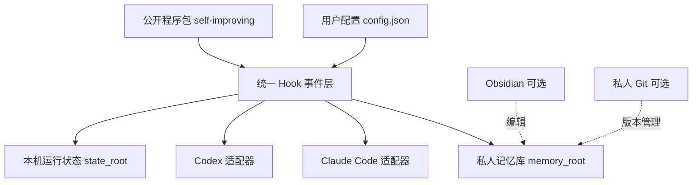
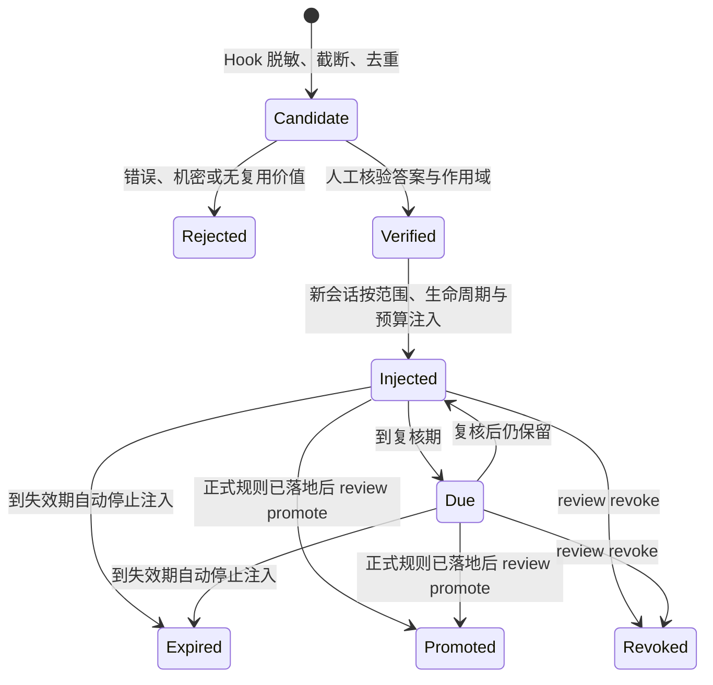

# Doraemon 跨 Agent 自我进化记忆系统架构与设计

> V2.3.5 · 2026-09-11 · 对齐 self-improving 3.1.2 工作树的知识路由、索引和守门说明；版本历史见 [CHANGELOG](../CHANGELOG.md)。

本文解释 self-improving 的整体设计：系统分成哪几层、Hook 怎样接入 Claude Code 与 Codex、一条纠错从捕获到生效要过哪些关卡，以及关键方案为什么这样取舍。安装与日常操作请读 [五分钟从零开始](quickstart-zh.md)，本文不重复命令细节。

> 事实优先级：真实运行结果 > 当前配置和代码 > 本文。规划不写成已上线。

## 1. 四层分离

第一条设计决策：程序与数据彻底分开。程序可以公开、升级、回滚；用户数据永远留在用户自己选择的目录。


```mermaid
flowchart TD
    P["公开程序包 self-improving"]
    C["用户配置 config.json"]
    D["私人记忆库 memory_root"]
    S["本机运行状态 state_root"]
    H["统一 Hook 事件层"]
    CL["Claude Code 适配器"]
    CX["Codex 适配器"]
    O["Obsidian 可选"]
    G["私人 Git 可选"]
    P --> H
    C --> H
    H --> CL
    H --> CX
    H --> D
    H --> S
    O -. "编辑" .-> D
    G -. "版本管理" .-> D
```

| 层 | 位置 | 内容 |
|---|---|---|
| 公开程序 | 本仓库 `self-improving/` | 代码、模板、安装器、测试、文档；不含任何用户数据 |
| 用户配置 | 默认 `~/.config/self-improving/config.json`，可用 `SELF_IMPROVING_CONFIG` 覆盖 | 记忆库位置、启用的 Agent、捕获与注入开关 |
| 私人记忆 | 配置中的 `memory_root`，位置由用户决定 | 核心记忆、纠错流水、候选箱、审批账本 |
| 运行状态 | 配置中的 `state_root` | 备份、迁移清单、文件锁、按会话保存的已注入内容摘要 |

私人记忆可以放普通文件夹、Obsidian Vault 或私人 Git 仓库——它们只是装数据的盒子，都不是安装前提。

## 2. 目标与非目标

目标：

1. Claude Code 与 Codex 共享同一审批账本；新会话只注入当前适用的临时纠错，自由文本知识按需读取。
2. 两个平台的明确纠错都由 Hook 自动进入未验证候选箱，不靠 Agent 记得执行命令。
3. 候选必须经人工审核并明确选择全局/项目范围，才能进入机器可验证审批账本；历史纠错流水不会因升级突然变成指令。
4. 用户可配置、关闭持久化、升级、迁移和卸载；默认保留私人数据。
5. 陌生用户从 GitHub 下载后，不需要知道作者路径，也不强制安装 Obsidian。

非目标：

- 不上传私人记忆、对话、日志、凭据或 Hook 信任状态。
- 不关闭 Claude/Codex 原生私有记忆。
- 不把网页、PDF、邮件、命令输出或子 Agent 结论自动晋升成权威规则。
- 不为未经真实客户端验证的 Agent（Gemini 等）伪造适配状态。
- 不承诺 Hook 能拦截平台尚未提供事件的全部文件编辑方式。

## 3. 私人记忆库结构

初始化时程序创建的固定入口：

```text
<memory_root>/
├── memory.md                        # 按需知识入口；默认不注入
├── index.md                         # `sync` 自动生成的知识索引
├── corrections.md                   # 人类可读的纠错审计流水
├── .self-improving/
│   └── verified-corrections.jsonl  # 机器可验证的审批账本（追加式事件真身）
└── .learnings/
    ├── CORRECTIONS_INBOX.md         # 未验证纠错候选箱
    └── ERRORS.md                    # 不可信错误摘要（默认关闭集中持久化）
```

旧 `corrections.md` 是可选历史资料。已有标记的记忆目录归档该文件后，初始化不再重建它，体检也不因缺失而失败；旧 Markdown 导入不搜索归档目录，候选和新版审批链路保持原样。

固定入口之外，用户可以按主题自建知识目录。未登记知识目录时，`sync` 生成记忆库 Markdown 文件索引；登记后，`index.md` 改为登记条目和分类入口，全量文件清单通过 `knowledge list --all` 查询。索引生成本身不注入上下文；Hook 提供的知识正文计入事件预算，显式读取另占任务上下文。

固定入口名不改；规范类知识文档建议在标题下用版本头 `> VX.Y.Z · YYYY-MM-DD · 本次变更一句话` 记录演进，文件名保持稳定，避免每次更新制造改名和断链。

## 4. Hook 接入

Claude Code 和 Codex 的原始 Hook JSON 先由平台适配器转换成统一事件，写入逻辑只消费统一事件，不理解各平台原始格式：

```text
platform / event / session_id / source / cwd / prompt / tool_name /
tool_input / tool_output / exit_status / failed / trust_level
```

两平台都接入五类事件：

| 事件 | 行为 |
|---|---|
| `SessionStart` | 按优先级、作用域、生命周期和预算注入 v2 纠错；无知识目录且默认 `skip` 时，恢复只发送变化后的完整替换或清空信号；有目录时重置知识去重，恢复重新提供基础上下文，压缩恢复仍有效的最近请求；遗漏与损坏生成收据 |
| `UserPromptSubmit` | 开启捕获时，明确纠错经脱敏、截断、按天去重后进入候选箱，并记录命中词与上下文；系统标签开头、超过1500字符及只在代码围栏内命中不算纠错。有知识目录时另行按需提供已复核原文，不依赖候选捕获开关 |
| `PreToolUse` | 命中权威文件（审批账本）常见写入或 Shell 批准/撤销命令时，Claude Code 弹权限框由用户当场批准；Codex 对 `Bash` 与 `apply_patch` 直接拒绝，改由用户在普通终端执行只含指纹的交互审核命令 |
| `PostToolUse` | 只按非零退出码或客户端失败标志捕获命令失败，不扫描输出关键词；默认关闭集中错误持久化 |
| `Stop` | 候选达到阈值且超过冷却时间时提示审核，不自动晋升；两端均以非阻断 `systemMessage` JSON 输出提醒 |

守门对整条 Shell 命令或 `apply_patch` 目标路径做文本扫描，不解析任意程序的真实副作用，定位是防误操作和"未经人批准的权威写入"，不是操作系统权限边界（详见[设计取舍](#8-设计取舍)第 4 条）。安装器采用"合并而非覆盖"：先备份当前配置，只移除旧版 self-improving 接线，保留其他第三方 Hook；五类 Hook 都有 10 秒上限，避免继承 Codex 的 600 秒默认超时。事件与守门的完整行为见 [hooks.md](hooks.md)。

## 5. 一条纠错的生命周期


```mermaid
stateDiagram-v2
    [*] --> Candidate: Hook 脱敏、截断、去重
    Candidate --> Rejected: 错误、机密或无复用价值
    Candidate --> Verified: 人工核验答案与作用域
    Verified --> Injected: 新会话按范围、生命周期与预算注入
    Injected --> Due: 到复核期
    Due --> Injected: 复核后仍保留
    Injected --> Expired: 到失效期自动停止注入
    Due --> Expired: 到失效期自动停止注入
    Injected --> Promoted: 正式规则已落地后 review promote
    Due --> Promoted: 正式规则已落地后 review promote
    Injected --> Revoked: review revoke
    Due --> Revoked: review revoke
```

三个信任层级，写入权逐层收紧：

| 层级 | 内容 | 是否自动注入 | 写入权 |
|---|---|---|---|
| 候选层 | 用户原话、命令错误 | 否 | Hook 可写 |
| 已验证纠错层 | v2 审核记录：答案、范围、优先级、归位目标、复核期与失效期 | 临时注入，受范围、生命周期与总预算限制 | 只有审核命令 |
| 按需知识层 | 领域、项目和风格文档；`memory.md` 只作可选入口 | 无目录时否；登记并复核后按需提供原文 | 按授权维护来源并复核版本 |

纠错的自动写入只做到候选层：捕获、脱敏、截断、按天去重、节流提醒。批准时必须选择 `global`、`repo:/仓库绝对路径` 或 `project:/绝对路径`，并写明正式归位目标。`repo` 作用域以 Git 身份保存，同一仓库的主目录和 linked worktree 命中同一规则。`review lifecycle-list` 展示活动、待复核和已失效明细；稳定规则归位全局规则、项目规则或 Skill 并验证后，运行 `review promote` 追加归位事件并停止注入。错误或不再适用的规则走 `review revoke`。两者都保留审计历史。Codex 每次只展示一条含指纹的交互命令，由用户复制到普通终端；规则正文与作用范围不进入 Shell 语法。

审核命令与完整教程见 [quickstart-zh.md](quickstart-zh.md) 第 6 节；历史流水的显式导入见其第 11 节。

## 6. 安全边界

`memory.md` 与 `corrections.md` 的授权修改和移动按普通文档维护；额外 Hook 守门保护审批账本与变更审核命令。只读 Python 检查按受限 AST 识别，不执行待检查代码；未知语法仍可能命中保守检测，拒绝提示不等于确认写入。具体边界见 [hooks.md](hooks.md)。

1. 私人数据与公开程序物理分离；程序仓库禁止出现任何用户数据。
2. 纠错和错误写入前执行常见令牌、密码、Cookie、私钥、URL 凭据脱敏。
3. 写入使用原子替换和跨平台文件锁；写后读回才算成功。
4. 权威记录结构异常或疑似含凭据时，启动 Hook 失败关闭；被预算淘汰、过期、待复核和旧版忽略项都生成收据，不静默消失。
5. 所有动态段共用默认 1200 token 估算预算；数量和字符上限只作第二道边界。自由文本 `memory.md` 默认关闭；未登记知识目录时，恢复会话只在内容摘要变化时发送一次完整替换，不能把新增内容误当成对旧集合的叠加。
6. 高风险任务可临时关闭持久化，读取不受影响（见 [quickstart-zh.md](quickstart-zh.md) 第 9 节）。

## 7. 体检分层

`python3 -m self_improving doctor` 把"装了"和"真的在学"分开报告：

| 层级 | 判定 |
|---|---|
| 已安装 | 程序、配置或入口存在 |
| 已启用 | 平台配置中的自有 Hook 命令、类型、匹配范围与 10 秒超时都符合当前版本 |
| 当前版本事件契约 | 新会话或脱敏真实结构回放已触发当前版本适配器 |
| 数据健康 | 核心预算、敏感信息、索引、普通链接、反引号路径、过期日期和错误库体积通过 |
| 学习闭环 | 待审核、可验证、适用、可注入、预算遗漏、旧版忽略、过期、待复核和损坏数分层报告 |

索引和断链属于提醒；缺配置、缺核心记忆、Hook 未接线属于失败。任何失败都不能宣称"系统全部正常"。

## 8. 设计取舍

这些方案被认真考虑过、然后被放弃或收紧。记录在此，避免后来者重新踩坑。

1. **放弃"同一说法出现三次就自动晋升"。** 重复只能证明内容多次出现，不能证明它正确；外部内容还可能借重复进行指令污染。晋升权保留给人，自动化只降低人的判断成本（预审草稿），不代替判断。
2. **审批账本用追加式 JSONL，不用 Markdown 表格。** Markdown 表格容易被管道符、行号漂移和混合排序破坏；同时维护"Markdown 审计 + 运行状态"两份文件，部分失败会造成只写成一份的假审计。追加式单一事件真身（批准、撤销、再批准都是新事件，当前状态由折叠计算）从根上消除这两类问题。
3. **配置用 JSON，不用 YAML/TOML。** Python 标准库直接解析，零第三方依赖；配置带 `schema_version`，升级只通过迁移器改版，缺失或过高版本明确失败，不静默回退。
4. **守门服从平台真实能力，不冒充安全沙箱。** Claude Code 支持 `ask`，因此命中后弹框请人批准；Codex 当前会把 `ask` 视为 Hook 失败并继续工具调用，所以必须返回 `deny`，审核改到 Agent 工具循环之外的普通终端。Codex 同时匹配 `Bash` 与 `apply_patch`，堵住最常见的两条直接写入路径；终端命令只携带格式固定的指纹或旧记录 ID，规则正文与作用范围走交互输入，避免候选文本进入 Shell 语法层。文本扫描能挡住误操作和常规的未授权权威写入，但与用户同账号的任意代码仍可故意绕过。强防篡改要靠私有 Git 审计或系统级权限隔离，不靠 Hook。
5. **不提供"历史流水一键全部启用"。** 旧纠错流水没有可靠的作用域信息，批量全局注入会把某个项目的经验广播到无关任务。每条历史规则必须重新提炼、显式选范围、保留可撤销指纹。
6. **平台差异收进适配层。** 最脆弱的外部前提是 Claude/Codex 的 Hook 输入格式会继续变化，因此核心写入逻辑只消费统一事件，平台字段不进入核心；新平台没有经过真实客户端事件验证前，不冒充已支持。
7. **Obsidian 与 Git 都是可选项。** 程序只认配置里的 `memory_root`，不猜目录、不绑定编辑器；作者本机用 Obsidian 只是个人选择，不是架构的一部分。
8. **捕获过滤不只靠机器标签黑名单，必须有一条与文本长相无关的判据。** 关键词命中只是"用户在纠错"的弱相关特征，不是证据；文本越长越必然偶然包含关键词，长度趋大时误判概率趋近 1。客户端把后台生成的长提示词塞进用户消息通道时（实测为 Codex 的 ambient suggestions），标签黑名单天然失效——它只能枚举已知形态。因此在黑名单之外加一条长度上限：纠错是人对上一轮输出的即时否定，天然简短，超长文本无论内容如何都不是纠错。这条判据不需要预知机器消息长什么样，是黑名单追不上新形态时的兜底。同理，英文关键词要求前后不是英文字母，否则 `remembering` 之类的派生词会命中 `remember`；这里刻意不用 `\b`，因为正则把中文也算作词字符，用 `\b` 会让「请remember先读文件」这种中英紧贴的写法漏捕。
9. **过滤会漏，所以候选必须自带"为什么被抓"。** 关键词匹配跑在完整提示词上，候选箱只存截断后的 500 字符，于是命中词可能根本不在人能看到的那段里——四条机器候选就是这样让人在审核时说不清它为何入库。补救不是继续加过滤规则（规则永远追不上），而是把命中词与上下文写进候选行的命中列：过滤漏了没关系，只要审核者一眼能看出触发原因，漏网噪音当场就能识别。命中文本同样脱敏截断，且不参与指纹计算——同一句话不因命中词不同而重复入库。

## 9. 按需知识与维护联检

私人 knowledge-catalog.json 是路由单源，正文不另抄摘要；sync 生成现役视图并保留全量发现，doctor 报告路径与版本状态。知识命中读取原文章节，完整性要求通过全文读取入口维持，不能以摘要替代。详细字段和命令只在 [knowledge.md](knowledge.md) 维护。

登记目录后，启动、恢复、清空、压缩重置知识去重，压缩只恢复最近任务命中的有效作用域；UserPromptSubmit 按需增量提供正文和失效提示。读取与候选捕获独立，两类事件的最终合并输出共用默认1200个估算 token。知识子进程限时1秒，故障不改变原审批守卫。

文件变化是复核线索，语义冲突由授权维护中的 Agent 判断；accept 绑定精确版本和直接依赖，不审批候选，不撤销账本。安全读取绑定同一批字节，拒绝软链竞态与敏感来源；回退前核对文件没有后续修改。

## 10. 相关文档

| 想做什么 | 读哪份 |
|---|---|
| 从零装好并跑通第一条纠错 | [quickstart-zh.md](quickstart-zh.md) |
| 出问题排查 | [troubleshooting-zh.md](troubleshooting-zh.md) |
| 配置项与注入预算 | [configuration.md](configuration.md) |
| Hook 事件与守门细节 | [hooks.md](hooks.md) |
| 从旧版脚本迁移 | [migration.md](migration.md) |
| 隐私边界 | [privacy.md](privacy.md) |
| 知识登记、复核与按需读取 | [knowledge.md](knowledge.md) |
