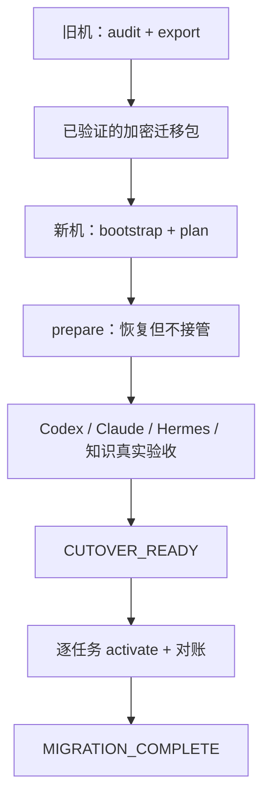

# AI Agent 工作环境迁移与可重复重建：实施规格

```yaml
document_role: implementation-contract-for-ai-agent
spec_status: superseded
superseded_by: 新机转移V3.md
primary_migration: Apple-Silicon-MacBook -> Apple-Silicon-Mac-Mini
first_supported_target: darwin-arm64
implemented_commands: []
bootstrap_published: false
tested_on_clean_target: false
safe_to_copy_commands_from_this_document: false
last_revised: 2026-09-11
```

> 本文已被 [新机转移 V3](新机转移V3.md) 替代，仅保留旧稿供对照；其中的执行协议和命令不再作为施工指令。
>
> 本文出现的命令名、目录结构和接口均为“待实现目标”。在 `implemented_commands`、发布版本、固定摘要和干净新机测试记录全部补齐前，它们都不是现有可执行命令，不得让用户复制运行，也不得把文档完成误报为迁移完成。

## 0．Agent 执行协议

### 0.1 强制用语

- **必须**：缺失即不能交付，相关阶段不得标记成功。
- **应当**：原则上必须实现；确有阻碍时，记录原因、影响和替代验证。
- **禁止**：实现、恢复和回退中均不得出现。
- **可选**：失败时可以让已独立通过的核心环境继续使用，但最终报告必须显示降级。

### 0.2 实施 Agent 的职责

Agent 接到本文后必须按以下顺序工作：

1. 先读取目标代码仓库中的 `AGENTS.md`、README、现有恢复手册和工作区状态，保护用户已有修改。
2. 在旧 MacBook 上做只读发现，建立真实 inventory；不能用本文中的示例路径、常见默认值或旧记忆替代实机证据。
3. 将无法自动判断、且会改变迁移结果的事项收敛为少量明确问题；在发现之前不得先让用户手填整套环境。
4. 实现并测试旧机 `audit/export`、新机 `bootstrap/restore`、组件 adapter、状态机、回退和报告。
5. 在干净的 Apple Silicon macOS 环境从零执行；临时 HOME、mock 和单元测试只能作为补充，不能替代真实新机验收。
6. 只有真实发布物、固定版本/摘要、两条一键入口和测试报告均存在后，才更新本文顶部状态。

Agent 不得因为某文件存在、某命令退出码为 0、某进程存在或某 plist 已生成，就推断客户端、知识、Hook、MCP 或业务任务已实际可用。

### 0.3 已锁定的用户决定

以下决定是本项目的固定输入，实施时不得重新解释：

1. 文档面向实施 Agent，不以新手教程的篇章结构为主。
2. 旧 MacBook 运行一次统一导出入口；新 Mac Mini 运行一次统一恢复入口。两条命令均允许必要的人机交互。
3. 当前迁移必须优先、完整支持 Apple Silicon Mac 到 Apple Silicon Mac。
4. 架构保留平台适配层；Windows 必须使用独立平台实现。第一版未实现 Windows 时，应明确返回 `UNSUPPORTED_PLATFORM`，禁止执行半套 macOS 流程。
5. 用户名、HOME、Homebrew 前缀、项目根、Obsidian Vault、Skill 根、运行时和服务路径均不得写死，必须从源机和目标机分别发现、解析和映射。
6. **OpenClaw 已弃用**：不备份、不恢复、不安装、不兼容、不启动。只允许在旧机审计中侦测残留并标记 `exclude`。
7. **Hermes 是现役系统**：必须与 Codex、Claude、Doraemon 同等级审计、恢复和真实验收；仅凭名称不得猜产品或配置目录。
8. 恢复默认只到“环境准备完成、业务待接管”。任何会向外部系统发送、写入、消费队列或定时执行的任务，都必须逐任务显式 `activate`。
9. 旧机在新机通过验收和接管前保持可用；不得为了测试新机而提前清空、升级或重构旧机。
10. 迁移与升级分开。恢复 session 内使用已锁定版本，不在重跑时重新解析 `latest`。

## 1．目标、边界与完成语义

### 1.1 目标

最终交付应让用户获得以下体验：

- 在旧 MacBook 输入一条命令，完成环境审计、必要决策、版本冻结、一致性快照、加密打包和自校验。
- 在新 Mac Mini 输入一条命令，完成引导、解密、依赖安装、仓库恢复、配置渲染、客户端接线、登录/权限门禁、真实验收和可续跑报告。
- 终端关闭、网络中断或系统要求重启后，再运行同一入口即可找到原 session、复核实况并继续。
- 新旧 macOS 账户短名称不相同、HOME 路径不同或工具实际前缀变化时，恢复仍正确完成。
- 业务任务在环境恢复期间保持关闭，只在旧机明确停用并完成最终增量后逐项接管。

“一条命令”表示一个统一入口，不表示零交互。管理员密码、Apple Command Line Tools 界面、GitHub 浏览器登录、age 解密口令、Codex/Claude/Hermes 登录和 macOS 隐私权限必须由用户确认；程序应保存安全 checkpoint 并清楚显示如何继续。

“旧机只运行一次”成立的前提是该命令同时建立最终快照边界：在最后确认后暂停会继续改动迁移数据的业务任务、同步器和客户端，完成最终 snapshot/export，并让这些 writer 保持停用直到新机接管或旧机 failback。若用户选择导出后继续在旧机工作，任何工具都不能保证原包仍是最终状态；此时只能把该包标为 `PRELIMINARY_EXPORT`，并在切换前补做增量，不能仍宣称“一次导出已同步全部”。

### 1.2 不属于目标

- 不复制旧机整个硬盘，也不把 Time Machine 当作配置模型。
- 不迁移普通缓存、锁、临时文件、可重建索引、`node_modules`、旧 `.venv` 或包管理器缓存。
- 不搬运 Codex/Claude 的旧聊天和普通会话历史来冒充知识恢复。
- 不批量复制浏览器 Cookie、Local Storage、Keychain 登录态、passkey 或 TCC 数据库。
- 不在恢复中顺便升级全部软件、清理旧软件或删除旧机数据。
- 不承诺 Homebrew cask、云端服务或滚动发行依赖能够字节级复刻；无法精确固定时必须如实标记。
- 不把 ChatGPT/Codex/Claude/Hermes 的账户侧云数据伪装成本地文件备份；这类对象登记账号归属并在登录后验证。

### 1.3 生命周期分类

inventory 中的每个对象必须且只能选择一个主动作；不允许只写含糊的“迁移”。

| 动作 | 适用内容 | 新机行为 |
| --- | --- | --- |
| `migrate` | 人工配置、规则、知识、不可重建数据、业务游标 | 从 Git 或加密包恢复，必要时按 schema 做路径适配 |
| `reinstall` | App、CLI、运行时、第三方插件、MCP 程序 | 按锁定来源与版本重新安装 |
| `rebuild` | venv、`node_modules`、缓存、派生索引、生成入口 | 从声明和 lockfile 重建 |
| `reauth` | OAuth、API 登录、浏览器会话、Keychain、TCC | 新机重新认证或人工授权 |
| `exclude` | 旧会话、普通日志、缓存、废弃工具 | 不进入迁移包，不影响成功判定 |
| `manual-decision` | 自动发现无法安全归类的对象 | 阻断 export，待用户明确选择后改为上述一种 |

### 1.4 阶段和完成门槛



| 顶层状态 | 必须满足的证据 |
| --- | --- |
| `AUDIT_BLOCKED` | 仍有 critical 未分类对象、脏仓库决策、秘密策略或任务所有者不明 |
| `PRELIMINARY_EXPORT` | 包已校验但源端仍可能变化，或尚有最终快照待完成；只允许新机 dry-run，不允许 cutover |
| `EXPORT_VERIFIED_FINAL` | manifest 有效、迁移包实际解密复验、必需项有唯一动作，并已建立不再继续漂移的最终快照边界 |
| `RESTORE_PLANNED` | 新机只读 preflight、路径映射、空间估算、冲突和人工门禁均已列出 |
| `CORE_READY` | 原生工具链、Shell、Git、运行时、必要软件和仓库通过验证 |
| `AI_READY` | Codex、Claude、Hermes、Doraemon、必需 Skill/MCP/Hook 通过真实验证 |
| `OPTIONAL_DEGRADED` | 核心已通过，但 Token Tracker 等可选项失败或待处理 |
| `CUTOVER_READY` | 业务定义和状态已恢复到 staging，所有相关任务确认未启动 |
| `CUTOVER_PARTIAL` | 只有部分显式指定任务已接管，其余仍停用 |
| `MIGRATION_COMPLETE` | 全部 required 环境和用户确认范围内的任务完成接管与对账 |

## 2．总体架构与交付物

### 2.1 闭环原则

旧机 export 生成的 manifest、版本 lock 和迁移包，必须是新机 restore 的唯一权威输入。禁止分别维护一套“旧机备份清单”和另一套“新机安装清单”；二者一旦不闭环，就不能称为一键重建。

权威来源顺序如下：

1. 受版本控制的 dotfiles、Skills、Obsidian 和项目仓库，以及 export 时冻结的提交。
2. 加密迁移包内的不可重建私人文件、业务状态、一致性快照和选择性配置。
3. 已锁定身份的官方安装源或包管理器。
4. 新机重新建立的账号、OAuth、Keychain 和系统权限。
5. 明确记录的排除项。

同一对象必须有唯一 owner。禁止 Homebrew、fnm、npm global、uv、官方安装器和手工复制同时声称管理同一个可执行文件。

### 2.2 推荐仓库结构

实施 Agent 应在现有 dotfiles/迁移仓库中落地等价结构；可根据仓库惯例调整名称，但职责不得缺失：

```text
migration/
  bootstrap/
    bootstrap-macos.sh          # 裸 macOS 可运行的 POSIX sh 引导
    bootstrap-windows.ps1       # 将来独立实现；未支持时不得伪装成功
  bin/
    ai-env-migrate              # audit/export/restore/resume/status/verify
  platform/
    darwin-arm64/
    windows/                    # 明确能力矩阵，不复用 launchd/Homebrew 逻辑
  adapters/
    system/
    dotfiles/
    git/
    codex/
    claude/
    hermes/
    doraemon/
    obsidian/
    skills/
    mcp/
    ide/
    tasks/
  schemas/
    manifest.schema.json
    inventory.schema.json
    resolution-lock.schema.json
    state.schema.json
    task.schema.json
  tests/
    unit/
    integration/
    fault-injection/
    fixtures/
  docs/
    START-HERE.md
    CUTOVER/
    TEST-REPORT.md
```

裸机 bootstrap 在 Homebrew 安装前只能依赖 macOS 自带的 POSIX `/bin/sh` 与基础命令，不得使用 Bash 4 特性。结构化主流程可在 bootstrap 安装并锁定运行时后使用 Python 标准库实现；不新增常驻恢复服务或专用数据库。

### 2.3 必须交付的最终文件

- 旧机和新机各一条真实、可复制的一键命令。
- 固定的 bootstrap/recovery release、不可变下载地址、版本、签名或独立可信摘要。
- 旧机 `audit/export` 和新机 `restore/resume/status/verify` 实现。
- `darwin-arm64` 平台 adapter，以及 Windows 未支持时的明确拒绝行为。
- 本文列出的全部 required 组件 adapter。
- JSON Schema、状态机、错误码、脱敏日志和中文报告。
- 每个业务任务的 prepare/cutover/failback 手册。
- 故障注入结果及干净 Apple Silicon 新机的真实测试报告。

## 3．拟议命令契约

### 3.1 两个一键入口

真实发布后，用户只需看到两条入口：

```text
# 旧 MacBook：一条命令先做只读审计，确认后完成最终加密导出与源端冻结
<已发布且已校验的 bootstrap> export

# 新 Mac Mini：一条命令启动计划、准备、登录门禁和环境验收
<同一固定发布系列的 bootstrap> restore
```

本文禁止填写虚假 URL、示例 hash 或尚未存在的命令。发布时必须把实际命令、固定版本、摘要来源、测试日期和支持的 macOS 范围写入 `START-HERE.md`，并同步更新顶部 `implemented_commands`。

不得直接执行浮动 `main`，不得在未验证下载完整性时使用 `curl | sh`。一条命令内部也必须先把 bootstrap 完整下载到任务专用临时文件，校验非空、HTTP 状态、签名/摘要和 Shell 语法，再执行。

“两条入口”指用户需要记住和输入的外部入口，不代表内部只有两个动作。旧机入口内部完成 `audit → final export → source freeze`；新机入口内部完成 `plan → prepare → verify`，到达 `CUTOVER_READY` 后可以在同一交互会话中逐任务请求显式授权并调用内部 `activate`。用户若暂不接管或终端中断，之后仍只需重跑同一条新机入口来 resume，不要求记忆另一条安装命令。无论是否处于同一进程，`activate` 都是独立安全门，绝不能因 restore 重跑而自动通过。

### 3.2 内部 CLI

统一工具应提供以下稳定接口：

```text
ai-env-migrate audit [--json]
ai-env-migrate export [--mode <MODE>] [--destination <logical-or-resolved-path>]
ai-env-migrate verify-export --kit <path>
ai-env-migrate plan --kit <path> [--json]
ai-env-migrate restore --kit <path>
ai-env-migrate resume [--session <id>]
ai-env-migrate status [--session <id>] [--json]
ai-env-migrate verify [--component <id>] [--json]
ai-env-migrate activate --task <task-id>
ai-env-migrate deactivate --task <task-id>
ai-env-migrate reconcile --task <task-id>
ai-env-migrate failback --task <task-id>
```

约束：

- `MODE` 的允许值仅为 `preliminary` 或 `final`；实现必须拒绝其他值。
- `audit`、`plan`、`status` 必须严格只读；查询不得触发安装、更新、token 刷新、服务启动或业务请求。
- `export` 内部先执行/复用 audit；不得自动 commit、push、pull、upgrade 或修改现役配置。只有明确的 `final` 计划可以按批准 adapter 停用相关 writer，并必须保留可 failback 的状态证据。
- `restore` 默认执行到 `CUTOVER_READY`，不隐式调用 `activate`。
- `activate` 必须指定单个稳定 `task-id`，再次显示外部副作用并要求确认。
- `--force` 不得绕过完整性、备份失败、路径逃逸、脏仓库、任务双跑或未知外部结果门禁。
- 口令不得经命令参数、环境变量或 Shell history 传入；应从 TTY 隐藏读取或使用明确的系统秘密来源。
- 所有命令同时输出适合人的中文摘要和稳定 JSON；JSON schema 必须版本化。

### 3.3 退出码

| 退出码 | 语义 |
| --- | --- |
| `0` | 用户请求的当前阶段完整通过 |
| `10` | 等待登录、权限、解密或用户选择，可续跑 |
| `20` | 输入或 critical 决策缺失，尚未进入写入 |
| `21` | 认证或仓库权限阻塞 |
| `22` | 网络或下载源阻塞 |
| `23` | 签名、摘要、schema 或迁移包完整性失败 |
| `24` | 路径、仓库、配置或 ownership 冲突 |
| `25` | 平台、架构、空间或基础依赖不满足 |
| `30` | required 步骤失败，保留安全的部分结果 |
| `40` | 外部业务结果或游标状态不明，必须人工对账 |
| `70` | 已有同一范围的运行实例 |
| `130` | 用户中断，已保存可续跑 checkpoint |

未支持的平台统一返回退出码 `25`，JSON 的稳定 `reason_code` 为 `UNSUPPORTED_PLATFORM`；不得只输出一段自然语言后继续部分执行。

## 4．Manifest、版本锁与迁移包

### 4.1 恢复卡与加密载荷

导出目录建议如下：

```text
ai-env-export-<migration-id>/
  RECOVERY-CARD.md               # 无秘密；用户可离线查看
  recovery-card.json
  payload.age                    # 全部私人 manifest 和数据
  payload.age.sha256
  payload.signature              # 若发布/密钥体系支持
```

加密载荷解开后至少包含：

```text
payload/
  manifest.json
  inventory.json
  coverage-ledger.json
  machine-source.json
  path-map-source.json
  resolution-lock.json
  repositories.lock.json
  packages.lock.json
  tasks.json
  secrets-plan.json              # 只记录秘密名称和恢复策略，不记录值
  exclusions.json
  unresolved-decisions.json
  checksums.sha256
  evidence/                      # 脱敏证据
  git-bundles/                   # 经明确选择的本地-only Git 对象
  overlays/                      # dirty/untracked/ignored 的批准内容
  snapshots/                     # 一致性业务快照
  files/                         # 无法从 Git/安装器重建的必要文件
  export-report.md
```

恢复卡至少记录：migration ID、创建时间、所需 restore release、不可变下载位置、bootstrap 摘要、密文文件名和摘要、最低平台要求、续跑入口。不得记录 age 口令、token、私人配置全文或能直接滥用的凭据。恢复卡和解密口令必须分开保存，并在旧机之外实际可取得。

### 4.2 Manifest 对象模型

每个 inventory/manifest 对象至少包含：

```json
{
  "id": "stable-component-id",
  "category": "config|package|repository|knowledge|credential|task|data",
  "importance": "required|optional",
  "owner": "single-owning-adapter",
  "source_evidence": [],
  "source_path": {
    "resolved_for_audit": "<encrypted-evidence-only>",
    "anchor": "home",
    "relative": ".config/example"
  },
  "target_path_strategy": "resolve-anchor-on-target",
  "install_source": "official|homebrew|git|npm|uv|manual|account",
  "requested_version": "...",
  "source_version": "...",
  "resolved_version": "...",
  "target_version_reason": "preserve|compatibility|security|unavailable-source|manual",
  "version_policy": "exact|compatible-range|current-compatible|manual",
  "action": "migrate|reinstall|rebuild|reauth|exclude|manual-decision",
  "sensitive": false,
  "dependencies": [],
  "desired_active_state": "enabled|disabled|paused|not-applicable",
  "probe": "adapter-defined",
  "verify": "adapter-defined",
  "rollback_policy": "local-restore|forward-repair|old-machine-failback",
  "confidence": "high|medium|low",
  "decision_status": "resolved|unresolved"
}
```

对象关联必须使用稳定 ID，不得靠显示名称、绝对路径或数组位置关联。同一输入生成稳定排序，便于 diff 和审计。

`coverage-ledger.json` 必须把包管理器、运行进程、启动项、chezmoi deployed/source 差异、AI 客户端配置、项目根扫描、仓库、本地数据、知识根和用户补充范围交叉对账。每个发现项要么关联一个 manifest ID，要么带有明确 exclusion/decision；存在无法解释的高风险可执行项、持久化任务或唯一数据时，export 不能宣称“全量”。

### 4.3 版本冻结

`resolution-lock.json` 必须记录：

- bootstrap、主恢复器、schema 和 dotfiles commit。
- 所有必需仓库的规范化 remote identity、commit、子模块和 LFS 状态。
- Codex、Claude、Hermes、Doraemon、Obsidian、Token Tracker 的来源与实装版本。
- Homebrew、fnm、Node、npm/Corepack/pnpm/bun、uv、Python、Git、gh、chezmoi、age。
- 自管及核心第三方 Skill/Plugin、每个 MCP server、IDE 关键扩展和业务任务代码。
- 请求版本、实际解析版本、可取得时的发布物摘要、二进制架构，以及无法精确复现的原因。

控制面和行为敏感项优先使用 `exact`。若必须使用“当时最新版”，只允许在 export/session 创建时解析一次并立即锁定；同一 session 的重跑不能重新解析。恢复完成后的升级是另一项任务。

Homebrew Brewfile 是期望状态清单，不是 lockfile；`--no-upgrade` 只避免升级已经存在的包，不能让干净新机自动取得旧版本。无法固定的 formula/cask 应标记 `current-compatible`，同时记录源机版本、新机实际版本和差异，不得声称精确复刻。

## 5．平台与路径解析

### 5.1 平台层

核心流程不得到处散落 `uname`、Homebrew 路径或 `launchctl` 分支。平台 adapter 必须提供统一能力：

```text
detect_platform
detect_machine_arch
detect_process_arch
resolve_logical_paths
install_bootstrap_tools
resolve_package_provider
resolve_service_manager
resolve_shell_environment
enumerate_permission_gates
resolve_credential_bootstrap
```

第一版完成条件：

```text
platform = darwin
machine_arch = arm64
process_arch = arm64
package_provider = detected native Homebrew
service_manager = launchd
interactive_shell = discovered user shell, normally zsh
```

必须检测 Rosetta 翻译、Intel/ARM 双 Homebrew、同名多版本命令、错误架构的 Node/Python/原生扩展和 PATH shadowing。发现关键冲突时停止自动修复并报告候选来源，不按 PATH 第一项猜测。

Windows 使用独立 PowerShell bootstrap、Known Folder 解析、包管理策略、凭据和 Task Scheduler adapter。纯 Git/Markdown/JSON 数据可以复用通用 schema；LaunchAgent、TCC、Homebrew、Keychain 和 macOS 路径不得机械转换。Windows adapter 未完成时应在 preflight 立即退出，不写入任何内容。

### 5.2 逻辑路径

所有可迁移路径必须存为“逻辑锚点 + 相对路径”，示例：

```text
home://
documents://
config://
state://
cache://
app-support://
launch-agents://
workspace://<workspace-id>/
repo://<repo-id>/
vault://<vault-id>/
skill-root://<skill-root-id>/
```

规则：

1. 旧机解析后的绝对路径只用于加密审计证据和差异报告，不能作为目标路径。
2. 新机使用当前有效用户、系统 API/目录服务、工具配置和用户确认的根映射重新解析每个锚点。
3. 不要求新机沿用旧机短用户名；相同用户名只能减少差异，不能成为正确性前提。
4. 不写死用户主目录绝对路径、`/opt/homebrew`、`/usr/local`、`~/Documents/obsidian`、固定项目根或固定 `HERMES_HOME`。
5. 先通过架构、签名/receipt、版本和冲突检查唯一确定可信的 `brew_bin`，再以 `"$brew_bin" --prefix` 获取 Homebrew prefix；不得让未确认的 PATH 候选抢先响应。fnm、uv、chezmoi、Codex、Claude、Hermes、Doraemon 的有效根从环境、配置和工具输出发现。
6. 所有 Shell 变量和路径必须正确引用，测试包含空格、非 ASCII 字符和不同源/目标用户名。
7. LaunchAgent plist 不能依赖 `~`、`$HOME` 或交互 Shell；应在目标机把逻辑路径渲染为绝对 `ProgramArguments`、WorkingDirectory 和日志路径。
8. 软链保存 raw target、解析后 target、owner 和是否纳入迁移；新机按逻辑目标重建。目标未被迁移时，软链是 blocker。
9. 对 JSON/TOML/YAML/plist 等配置，只允许模板渲染或 schema-aware 字段更新；禁止对未知文件做旧用户名、旧 HOME 或旧前缀的全局字符串替换。
10. 对包含绝对路径的知识账本或版本身份，按业务规则重新验证；不能机械替换后继续沿用旧批准。

restore 完成前必须扫描新生成的文本配置、脚本、plist、shebang 和软链，确认不存在未批准的旧 HOME、旧用户名、旧 Homebrew prefix 或旧 repo/vault 根。二进制、数据库和加密文件不能用字符串替换处理。

## 6．旧 MacBook：audit 与 export

### 6.1 一键 export 的内部阶段

旧机一条入口按以下阶段执行：

```text
scope permission
→ read-only audit
→ unresolved decisions
→ freeze/lock
→ consistent snapshots
→ encrypted package
→ independent decrypt/verify
→ EXPORT_VERIFIED_FINAL
```

audit 始终只读。export 在最终冻结确认之前，除 export plan 中由用户明确批准的最小 bootstrap 依赖安装外，只允许写入任务专用临时目录和用户指定的导出目录；不得修改现役配置、升级既有软件、清理缓存、停止业务、启动服务或自动 push。用户明确选择 `FINAL_EXPORT` 后，同一入口才可按已审查的 task adapter 暂停相关 writer、完成最终快照，并让它们保持停用。若需要加密工具，优先随已验证 release 提供；否则进入上述授权门禁，不能静默改变旧机。

### 6.2 开始审计前的最小授权

Agent 只询问会改变扫描边界的事项：

- 是否允许只读检查当前用户目录、已知项目根、用户 LaunchAgents、crontab、登录项和运行进程。
- 是否存在禁止扫描的私人目录。
- 是否允许读取配置结构、键名、权限和 hash，但绝不输出秘密值。
- 旧机哪些业务必须持续运行，审计期间禁止停用。
- 导出介质/目录和可用空间。

随后先自动发现。只有同名工具身份、dirty repo 去向、未知秘密策略、任务副作用、数据库安全快照方式等无法可靠判断时，才向用户提问。存在未解决 critical 项时不得 export。

真正封装前必须显示一份具体 export plan：会读取和复制的逻辑对象、local-only Git 的处置、需要的在线一致性备份、是否存在短暂停写门禁、明文 staging、导出目的地、预计空间、秘密分类和明确排除项。用户确认的是这份实际计划，而不是笼统的“允许全盘备份”。

### 6.3 机器与工具链发现

至少记录：

- macOS 版本和 build、机器架构、当前进程架构、Rosetta 状态、UID、真实 HOME、登录 Shell、时区、语言、磁盘空间和 FileVault 状态。
- 已挂载导出介质及其文件系统、剩余空间和是否支持预期权限/文件类型。
- 对每个关键命令执行等价于 `command -v "$name"` 的首选解析，同时枚举 PATH 中其他同名候选；记录软链解析、版本、二进制架构、安装 receipt/source 和候选冲突。`name` 必须来自内部允许列表，不能拼接未经校验的用户文本。
- Homebrew prefix、版本、taps、leaves、formula、cask、services 和 Brewfile 与实装差异。
- fnm、已安装/default/current Node、npm global prefix、全局包精确版本、Corepack/pnpm/bun，以及 nvm/Homebrew Node 冲突。
- uv 来源和版本、uv-managed Python、`uv tool list` 的已安装工具、Python 的实际 `sys.executable`/版本/架构，以及 pipx/Homebrew/system Python 冲突。
- Git、gh、chezmoi、age、Codex、Claude、Hermes、Doraemon、Obsidian、Token Tracker 和实际使用 IDE。

软件身份的证据优先级为：当前进程可执行路径、解析后命令路径、包管理 receipt、App Bundle ID/签名/版本、配置中的明确来源、Git remote、用户确认。无法唯一确定时标记 `manual-decision`，不得按名字猜安装方式。

### 6.4 chezmoi 与配置真身

如果存在 chezmoi，audit 必须发现并建立以下映射：

```text
部署目标
→ chezmoi source 对象
→ 模板变量与加密方式
→ source/deployed 是否漂移
→ owner adapter
→ apply 是否会执行脚本或启动服务
```

必须检查 source directory、destination、managed 列表、diff、`.chezmoi*` 模板、age 设置、`run_once_*`、`run_onchange_*` 和外部脚本。路径已被 chezmoi 列出不代表源文件与现役配置一致，也不代表其子文件全部被纳管。

### 6.5 Git 仓库与本地独有工作

仓库候选集依次来自：dotfiles/chezmoi 引用、LaunchAgent/crontab/Hook/MCP 工作目录、Doraemon knowledge catalog、Obsidian vault、IDE recent workspace、Shell 配置，以及用户确认的有限项目根。可在 HOME 下做有边界且不跟随软链的补漏扫描，但必须排除缓存、依赖、系统库和用户禁止目录；不能因为扫描成本而直接假定 `~/Projects` 是唯一根。

每个仓库记录：

- 逻辑 repo ID、解析路径、规范化 remote identity、当前分支、HEAD、upstream、ahead/behind。
- dirty/untracked/ignored、stash、worktree、本地 tag、本地-only commit 和未推送分支。
- Git LFS、submodule、sparse checkout、Git hooks 和 `core.hooksPath`。
- 外部附件、云端占位文件是否已真实下载。

audit 不执行 commit、checkout、pull、push 或 reset。export 时：

- 远端已经完整覆盖的 clean repo 只需锁定 remote 与 commit。
- 本地-only commit/branch/tag 由用户选择显式 push，或生成并验证 Git bundle 纳入加密包。
- dirty、untracked、必要 ignored 内容以加密 overlay/补充包保存，保留文件类型、权限、hash 和应用顺序；不得偷偷替用户 commit。
- 工作树在 audit 与 export 间变化时停止该项并重新决策。

### 6.6 启动项、任务和业务状态发现

至少审计：用户及相关系统 LaunchAgents/LaunchDaemons、当前 launchd 状态、用户 crontab、Login/Background Items、Shortcuts/Automator、Shell 启动副作用、Obsidian 插件自动行为、Hermes scheduler/cron、Codex 账户侧或本地 automation、项目常驻进程，以及实际使用时的 Docker/OrbStack/Colima。

每个任务必须记录 owner、稳定 task ID、定义来源、解释器、arguments、工作目录、环境变量名称、秘密来源、schedule、时区、`RunAtLoad`/`KeepAlive` 等条件、当前 desired/actual 状态、最后成功、水位/游标、防重复记录、日志位置、外部副作用和漏跑补偿办法。

自动分类只可给建议。任何可能发消息、调用付费 API、写远端数据库、消费队列、下单或修改外部系统的任务，都必须由用户确认，并在新机保持 `READY_NOT_ACTIVE`。

SQLite 或其他活动数据必须通过组件 adapter 使用在线一致性备份接口。若某任务只能停写后快照，普通预备导出不得擅自停止它；该 step 进入 `WAITING_USER`，稳定 `reason_code` 为 `PENDING_FINAL_SNAPSHOT`。在用户确认 `FINAL_EXPORT` 时，同一个旧机入口执行 quiesce、等待在途写入、生成最终快照，并保持 writer 停用。禁止运行中只复制主 SQLite 文件而遗漏 WAL/SHM。快照记录应用版本、schema/`user_version`、关键表计数、水位和完整性检查结果。

### 6.7 记忆、知识与秘密分类

audit 必须按语义而非目录名区分：

- 人工维护的长期知识和正式规则。
- 人工纠错账本与有效业务约定。
- Agent 自动生成 memory。
- 对话、摘要、日志、缓存和审计证据。
- 业务源数据、游标、防重记录和未完成工作。
- 可重新登录的凭据与无人值守任务必需的长期秘密。

不知道某内容是人工还是自动生成时不得自动排除。秘密审计只记录位置、键名、权限、hash、owner 和恢复方式；报告可写“存在 `OPENAI_API_KEY`”，不得输出值。含 token 的 URL、命令行和错误信息必须脱敏。

### 6.8 OpenClaw 的唯一处理方式：exclude

OpenClaw 不进入恢复依赖图。audit 只建立 `openclaw-remnants` 排除报告，检查但不打包：

- 程序/npm 全局包、配置、workspace、agents、skills、日志、缓存、状态和旧数据根。
- 旧 LaunchAgent、gateway、Dashboard token、渠道 token、定时任务、运行锁和游标。
- Brewfile/npm 清单、chezmoi 脚本、Hook、MCP、`restore/status` 和文档中的安装或兼容分支。

不得从 OpenClaw 目录复制 Telegram、飞书或其他渠道凭据来“继承”到 Hermes。若现役 Hermes 使用相同渠道，应作为新的 Hermes/业务秘密项从当前权威来源登记和恢复。

export 和新机 verify 必须确认**本迁移**没有安装、装载或启动 OpenClaw，且 Codex、Claude、Hermes、Doraemon、Hook、MCP、Skill 和任务均不依赖它；OpenClaw 缺失不得导致 overall failure。源机或目标机原有残留只标记 `exclude` 并报告，本迁移不自动删除；若残留进程仍有业务副作用，只阻断相关任务的 cutover，等待用户另行停用，不把它误算成 OpenClaw 恢复项。

### 6.9 export 的安全顺序与成功条件

1. 校验 audit schema、源机身份和扫描范围。
2. 拒绝 unresolved critical decisions。
3. 以 `umask 077` 创建 run-specific staging，记录 snapshot time 和 migration ID。
4. 重新 probe 源机实况；audit 后的 drift 必须重新处理。
5. 冻结 restore、dotfiles、仓库、运行时、Skill、MCP、插件和任务版本。
6. 生成 Git bundle/overlay、必要私人文件和业务一致性快照。
7. 在 allowlist staging 内构建规范化 archive；不直接归档任意绝对路径。
8. 从 TTY 读取 age 口令或使用批准 recipient，加密完整 payload。
9. 在另一个新建私有临时目录实际解密、安全展开并逐项核对 schema、文件数、类型、权限、软链和 hash。
10. 清除临时明文，保留加密包、恢复卡和脱敏报告。

至少保留两份相互独立的加密副本；GitHub 远端不能是唯一备份。仅能 `age -d` 不算完整验证，必须至少在另一个本地账户或隔离环境按受控解包器恢复并核对 Git LFS、本地-only 内容、业务快照和路径清单。

只有 required 项全部有动作、critical decision 为零、迁移包实际解密通过、快照完整性通过、Git 对象可获得、writer 已按最终冻结计划处理，才可标记 `EXPORT_VERIFIED_FINAL`。尚有 `WAITING_USER(reason=PENDING_FINAL_SNAPSHOT)`，或导出后旧机继续产生变化时，只能标记 `PRELIMINARY_EXPORT` 并明确需要最终增量；新机可以用它做 dry-run，但不能据此正式接管。

## 7．新 Mac Mini：bootstrap、restore 与 prepare

### 7.1 Preflight 与信任链

bootstrap 必须先完成：

- 验证当前系统为受支持的 macOS、机器和进程均为原生 arm64；若在 Rosetta shell 中运行，停止并给出进入原生终端的动作。
- 发现真实 HOME/UID/Shell、网络/代理前置、系统时间、磁盘空间和目标卷文件系统。
- 计算下载、解密、staging、baseline backup 和最终文件所需空间。
- 校验 recovery card、bootstrap release、签名/独立摘要、payload hash、schema 与 restore 兼容范围。
- 只读发现新机已有工具、目录和冲突；在任何覆盖前生成 restore plan。

若联网依赖代理/VPN，bootstrap 必须使用用户在裸机阶段可提供的系统网络或当前终端代理参数，或采用已验证的离线 release；不得要求先恢复一个尚未安装的代理应用才能取得恢复器。恢复器不擅自修改系统代理、VPN 或证书信任。

脚本与 checksum 来自同一个可篡改位置不构成独立信任。至少使用恢复卡中离线保存的摘要、受信发布签名或等价独立信任根。下载必须限制到批准 HTTPS host，检查重定向后的最终来源，拒绝空文件、HTML 错误页、摘要不符和未知签名。

完整流程以普通用户运行，只在具体 Homebrew/系统步骤请求提权。禁止全程 `sudo`、`sudo -E` 或把用户输入拼进 `sudo sh -c`，避免把用户配置写入 root HOME 或生成 root 所有文件。

### 7.2 Session 与续跑入口

首次校验 bootstrap 后，把固定副本和完整 release 保存到目标机解析出的私有 state root。session 至少固定：

- session/migration ID、目标 machine ID、平台和架构。
- manifest/payload hash、bootstrap、restore、schema 和 dotfiles 版本。
- resolution lock、恢复 profile、路径映射和 baseline backup ID。
- 每个 step 的输入 hash、状态、attempt、退出码与脱敏证据。

状态/秘密目录权限为 0700，状态与秘密数据文件为 0600；保存的 bootstrap/restore 可执行文件按需要使用 0500 或 0700，不能被“全部文件 0600”的规则去掉执行位。状态更新使用同目录临时文件、flush/fsync 和原子 rename。不得保存口令、token、完整秘密配置或未脱敏第三方输出。

Command Line Tools 安装、登录、重启或终端关闭后，用户再次运行同一条一键命令，bootstrap 必须识别既有 session 并优先调用本地固定版本，不重新下载浮动流程。打印并保存一个不依赖临时目录、dotfiles apply 或新 Shell PATH 的明确 resume 入口。

### 7.3 引导工具与认证

推荐顺序：

1. 检查/完成 Apple Command Line Tools。
2. 安装或复用唯一的原生 Homebrew；发现 Intel/ARM 双安装时停止并决策。
3. 安装 Git、GitHub CLI、chezmoi 和外部 age；当前方案使用 age passphrase 时，不能依赖不支持 passphrase 的内置替代实现。
4. 先唯一解析并验证目标 `brew` 可执行文件，再在当前进程执行等价于 `eval "$("$brew_bin" shellenv)"` 的受控加载；随后验证新的 `command -v brew` 仍指向同一实例。不从未确认的 PATH 候选执行，也不等待下次登录。
5. GitHub 浏览器登录后，对 manifest 允许的每个 hostname 执行 `gh auth setup-git --hostname "$github_host"`，再以 `gh auth status --hostname "$github_host"` 验证；`github_host` 必须来自规范化后的允许列表。
6. 对每个 required 私有仓库执行只读访问测试；`gh` 登录成功不等于 `git clone` 已认证。

token 不得嵌入 clone URL。若凭据工具回退到明文文件，必须显示风险并等待用户选择。SSH/GPG 身份按 secrets plan 重新生成、重新登录或经独立加密流程导入；不得整包复制 Keychain。

### 7.4 只读 plan

写入前必须展示：

- 源机/目标机平台、用户名和路径差异。
- 将安装、克隆、迁移、重建、重新认证和排除的数量与 required/optional 分组。
- 实际版本 lock、下载量、磁盘需求、备份根和 staging 根。
- 新机已有文件、不同 remote、同名多安装和软链冲突。
- 登录、TCC、重启等人工门禁。
- 将生成但不会启用的业务任务清单。

完整性、空间、架构、路径映射或 required 冲突未解决时禁止进入写入阶段。

### 7.5 Prepare 固定顺序

```text
native preflight
→ record bootstrap pre-state and mutation receipt root
→ bootstrap tools
→ decrypt and validate kit
→ render the complete mutation plan
→ capture per-target pre-state and immutable baselines
→ authenticate and verify repository access
→ install locked packages/runtimes
→ restore repositories and private data
→ apply static dotfiles without scripts
→ rebuild Skills/Plugins/MCP/Hooks
→ restore and verify knowledge
→ stage all business definitions
→ user login and macOS permission gates
→ real client verification
→ CUTOVER_READY
```

“先记录 pre-state”适用于 bootstrap、认证和包安装等不承诺自动回滚的动作，至少记录 owner、来源、版本、目标和前态，失败后走 forward repair；“immutable baseline”适用于普通配置、已有 repo/目录和其他可本地回退目标。任何具体目标都必须在**第一次修改它之前**完成相应 pre-state/backup，不能等前序步骤写完后再补记。

所有可能产生外部业务结果的动作只能出现在显式 `activate`。prepare 禁止：

- 写入活动 crontab。
- 把业务 plist 放入登录即运行的正式 LaunchAgents 位置。
- 启动 Hermes gateway/cron delivery 或其他业务服务。
- 发送真实业务消息、消费真实队列、写远端业务系统。
- 按旧机 `enabled` 状态自动接管。

任务定义先渲染到 session staging，并执行语法、路径和无副作用 dry-run。原来 paused 的任务恢复其 desired state，但保持未启动。登录、重启、打开新终端、运行普通 chezmoi apply 或安装应用均不得绕过门禁。

## 8．组件 Adapter 规格

### 8.1 Homebrew、Shell 与基础软件

Homebrew 清单应拆成等价的 bootstrap/core/apps 三层，业务服务不得进入 Brewfile。静态审计 Brewfile 中的 service restart、postinstall、任意 `system` 或其他可执行逻辑，保证 prepare 无业务副作用；`brew bundle cleanup` 和自动卸载不属于恢复流程。

每个关键 CLI 验证路径、版本、来源和架构。Homebrew 安装后在当前进程使用实际 prefix；Shell 配置纳管 `.zprofile`、`.zshrc` 和确有需要的 `.zshenv`，检查 alias/function/completion/prompt 与 PATH owner。至少验证：

- 登录 Shell：例如 `zsh -lc 'printf "%s\n" "$PATH"'`。
- 交互登录 Shell：例如 `zsh -lic 'printf "%s\n" "$PATH"'`。
- IDE 集成终端。
- LaunchAgent 的独立非交互环境。

LaunchAgent 不会可靠继承交互式 fnm/uv 环境。任务应使用受控 wrapper 或目标机解析出的绝对解释器，并给出最小、显式环境。

### 8.2 fnm、Node 与 JavaScript 工具

fnm 是用户交互 Node 的唯一 owner；audit 后必须显式处理 nvm、Homebrew Node 或其他残留冲突。记录 fnm 来源/版本/根、已安装 Node 完整版本、默认版本、当前版本、npm global prefix、全局包精确版本、Corepack/pnpm/bun 和各项目 `.node-version`、`.nvmrc`、`engines`、`packageManager`/lockfile。

迁移 Shell 声明和版本清单；重装 fnm/Node/全局 CLI；从 lockfile 重建 `node_modules` 和原生模块。即使源/目标都是 Apple Silicon，也不得复制旧 native modules。新机验证登录/非交互/IDE/服务所用 Node 唯一、版本和 `process.arch` 正确。

Hermes 若由自身官方安装器管理内部 runtime，不得假定它与用户 fnm Node 是同一套；分别记录和验证 owner。

### 8.3 uv 与 Python

uv 必须有唯一 owner（Homebrew 或官方 standalone，按 lock 选定），不得同时让两者管理并混用自更新。记录 uv 来源/版本、managed Python、`uv tool`、每个项目的 `.python-version`、`requires-python`、`pyproject.toml`/`uv.lock`，以及 Hook/MCP/Hermes/Doraemon/LaunchAgent 实际解释器。

迁移非秘密配置、Python 版本清单和项目声明；重装 uv/Python/uv tools；重建全部 `.venv`、native wheels 和 shebang。排除 pip/uv cache。验证 `uv python find`、`sys.executable`、完整 Python 版本、架构、项目 lock 同步、IDE 绑定和所有后台入口。

Hermes 自带 runtime 时与用户 uv 分开处理，不能为了统一而破坏官方支持方式。

### 8.4 Git、GitHub CLI、SSH 与签名

迁移 `.gitconfig`、conditional includes、global ignore、自管 hooks、SSH/GPG 非秘密配置和仓库 manifest。审计 user/email、默认分支、aliases、credential helper、`core.hooksPath`、签名方式、SSH aliases、known_hosts、agent、GPG/pinentry、gh extensions/aliases，以及每个仓库的本地状态。

gh token、浏览器 token 和 Keychain 会话默认不复制；在新机重新 `gh auth login`、配置 Git credential helper，并分别验证 `gh auth status`、私有仓库的 `git ls-remote`、`git clone`/`git fetch` 和实际 push 权限。SSH/GPG 私钥若必须保持身份，需进入独立最高敏感级加密流程；否则新机生成并重新授权。任何选择都必须写入 secrets plan。

仓库恢复到 lock 指定 commit，而不是克隆默认分支后把当天 HEAD 当作目标。新目录先在同一文件系统的 session staging clone/fetch、核对 remote/commit/LFS/submodule，再原子移动。已有目录若 remote 不同、dirty 或分叉，停止；禁止 reset、清空或覆盖。

### 8.5 Codex

audit 从有效 `CODEX_HOME` 和项目实况发现：

- CLI/桌面端的真实路径、版本、Bundle ID、安装来源和架构。
- 用户配置、profiles、全局 `AGENTS.md`、规则、自定义命令、Hook、wrapper、Skills 和 MCP。
- 项目内 `AGENTS.md`、`.codex/config.toml`、规则/Hook/Skill，以及项目 trust 前置。
- Provider、模型、功能开关和超时等非秘密设置。
- 人工维护的长期知识与自动生成 local memories 的边界。
- Token Tracker 接线和 Codex 日志防护。

迁移人工配置、规则、自管 Skill/Hook/MCP 结构和经确认的人工知识。`CODEX_HOME` 下的认证、旧 session、普通日志、cache、锁和内部数据库默认 `reauth/exclude`。如果旧环境确有人工维护内容位于自动 memory 目录，必须按内容 owner 单独提取到正式文档或明确的人工目录，不能整目录排除，也不能依赖未公开子目录作为长期 API。

新机重新登录并完成真实请求；验证全局/项目规则、项目 trust、每个 required Skill、MCP 最小只读调用、Hook 新事件和 Doraemon。ChatGPT/Codex 账户侧 memory、Apps、Connectors、Automations 单独登记，登录后验证，不伪造本地副本。

#### Codex 日志防护

保留自管日志防护脚本和定义，但把启用顺序改为 **Codex 核心、真实请求、MCP、Hook、规则和 memory 验收之后**。不迁移旧日志数据库。

启用前必须：识别当前 Codex 版本与实际 state/log DB；检查数据库文件 owner/权限；只对白名单 schema/version 工作；先做一致性备份；在隔离 fixture 验证安装、阻止新增、重复执行、触发器重建和卸载。schema 不匹配或目标 DB 尚未生成时不得写入，状态为 `WAITING_TARGET_DB` 或 `BLOCKED_UNSUPPORTED_SCHEMA`，不能伪报保护已生效。

自管工具的发布名固定为 `codex-log-guard`，并把锁定来源、版本、hash 和目标机解析后的绝对路径写入 manifest。必须交付完整接口 `codex-log-guard status`、`codex-log-guard enable`、`codex-log-guard disable` 和 `codex-log-guard remove-trigger`；仅停止 LaunchAgent 不等于移除数据库触发器。故障排查时可显式暂停防护并恢复诊断能力。该功能依赖内部数据库，不得把它写成 Codex 官方稳定接口。

#### Token Tracker

Token Tracker 作为 optional 组件在新机按锁定来源和版本重装，不迁移旧缓存、状态栏脚本或本地补丁。先完成 Codex/Claude 本体，再由 Token Tracker 自己重建两端接线；检查并删除悬空旧 Hook，同时保留其他 Hook。实际产生一个新请求并看到用量后才通过。失败形成 `OPTIONAL_DEGRADED`，不伪造全量成功。

### 8.6 Claude Code

从有效 `CLAUDE_CONFIG_DIR` 解析配置根，并分别审计：用户 `settings`、项目共享 settings、项目 local settings、全局/项目 `CLAUDE.md`、`.claude/rules`、commands、agents、plugins、skills、hooks、status line 和 MCP。

`settings.local.json` 必须按 key 分类。历史机器权限放行不迁移；若混有唯一的有意配置，先拆分到正确 owner，不能仅凭文件名整份排除。`~/.claude.json`（或有效配置根对应对象）混合登录 session、local/user MCP、project trust 和 global 状态，不得整文件复制；提取可迁移的非秘密设置，登录、MCP OAuth 和 trust 在新机重建。

Claude 原生 auto memory 与会话必须分开：

- `CLAUDE.md` 和 `.claude/rules/` 等人工规则迁移。
- 项目会话/JSONL、cache、锁和历史权限排除。
- auto memory 单独盘点。仍有长期价值的内容优先晋升到项目文档、Obsidian 或 Doraemon；若选择保留项目 memory，按项目 repo ID/逻辑 workspace 映射并标记为尽力迁移，不能因路径变化盲拷贝。
- 不得整体排除项目目录后仍声称 Claude 记忆已恢复。

Claude Code 读取 `CLAUDE.md`；若与 Codex 共用规则，在 `CLAUDE.md` 显式导入 `@AGENTS.md`，不能假定它会直接采用 `AGENTS.md`。新机重新登录，并以真实请求、memory/context、hooks、MCP connected、custom command/agent 和 Doraemon 新事件验收。

`claude-mem` 已停用：插件、Hook、数据和悬空入口全部 `exclude`，不恢复。

### 8.7 Hermes

Hermes 是 required 一级组件，但名称可能对应不同产品。adapter 选择前必须保存以下产品指纹：

```text
command -v hermes
resolved executable and symlink chain
hermes --version
hermes --help
package/install receipt
upstream repository or application identity
effective config/data roots
```

只有产品指纹与受支持 adapter 完全匹配时才继续；否则标记 `UNKNOWN_HERMES_IMPLEMENTATION` 并阻断 required 恢复。禁止因为常见默认值而直接复制 `~/.hermes`。

通用 Hermes audit 至少覆盖：安装来源/版本/架构、config/data/cache/workspace roots、Agent 定义和 system prompt、模型/provider/fallback、Skills/Plugins/MCP/工具权限、Doraemon Hook、channel integrations、scheduler/cron、服务/LaunchAgent、业务游标/防重记录、memory/session/cache 边界、本地 patch 的基线 commit 与应用顺序。

#### 若实机确认为 Nous Research Hermes Agent

- 使用 export 时锁定版本所支持的官方 macOS Apple Silicon 安装来源；不得臆造 Homebrew formula 或 PyPI 作为受支持本体来源。
- 优先调用对应锁定版本的官方接口：源机全量导出使用 `hermes backup -o <private-staging/hermes.zip>`，目标机导入使用 `hermes import <backup.zip>`；按当前 CLI Reference，单 profile 使用 `hermes profile export <profile> -o <archive.tar.gz>` 和 `hermes profile import <archive.tar.gz> --name <profile>`。官方 FAQ 与当前 CLI Reference 对 profile 参数曾出现差异，因此 adapter 必须以**锁定版本的本机 `--help`**为最终 argv 契约，不重新猜测其内部数据库、memory、skills、cron 和 session 格式。
- 有效数据根由实际 `HERMES_HOME`/CLI/config 解析；默认目录只可作候选，不可作事实。
- full backup 可能包含 `.env`、`auth.json` 等凭据，必须视为最高敏感级数据并立即纳入外层 age 加密；不得进入 Git、普通日志或非私有临时目录。若决定不迁移凭据，使用不含凭据的 profile 方式并在新机重新认证。
- Hermes 安装器拥有的内部 runtime 与用户 fnm/uv 分开，不强行统一。
- macOS 服务通过 Hermes 自己的 `hermes gateway install` 在目标机重建，不复制旧 plist。因为服务会捕获当时环境，必须在全部 runtime/PATH 完成后处理。
- prepare 阶段 gateway 和 cron delivery 必须保持停止。先以锁定版本的 `--help` 和隔离测试确认 `hermes gateway install` 的实际行为；若不能证明 install 后仍保持停止，则将整个 install 动作延后到显式 activate。禁止猜测或自行添加未记录的 `--no-start` 一类参数。
- 导入后先核对 provider、tool 权限、路径、skills、memory，并运行只读的 `hermes cron list`、`hermes cron status`、`hermes cron doctor`；再以隔离测试 profile/job 做仅写本地测试目录、禁止外部 delivery、无生产凭据的 canary。真实 delivery 只能在旧机相应消费者停用后逐任务启用。

Hermes 最终验收包括唯一正确 CLI、版本/来源/架构、doctor、一次真实对话、规则/Skill/MCP/Doraemon 读取、服务状态、cron 的只读检查与无外部投递 canary，以及实际使用渠道的逐项认证与接管。不能以配置文件存在替代这些证据，也不得臆造不存在的通用 `cron dry-run` 接口。

### 8.8 Doraemon

Doraemon 的 executable、版本、安装源、Python/uv、配置、`memory_root` 和 `state_root` 必须从有效配置解析，不能假定全部位于 Obsidian 或某个固定 HOME 子目录。

| 逻辑对象 | 处理方式 |
| --- | --- |
| `memory_root/.self-improving-root`、人工文档和附件 | 迁移根标记与完整内容 |
| `memory_root/knowledge-catalog.json` | 迁移目录；检查 roots、来源、逻辑部署路径和直接依赖 |
| `memory_root/.self-improving/verified-corrections.jsonl` | 完整迁移含撤销/归位事件，不摘录重写、不重新批准或延长有效期 |
| `state_root/knowledge/accepted.json` | 作为知识复核依据单独登记；只在版本/schema 匹配时沿用 |
| 会话去重、事件证据、运行锁和普通状态 | 新机重建，不把旧机事件冒充验收 |
| `.learnings` 候选、错误和旧审计 | 人工决定归档或保留审计副本；不默认注入有效知识 |

恢复顺序：锁定程序/解释器 → 完整私人数据 → 目标机路径配置 → 对已有配置执行 `upgrade`/等价升级接线 → `knowledge check/read` → 必要复核 → `sync` → `doctor` → 三个客户端真实验证。仅全新、没有已恢复配置时才允许 `init`。

路径或 repo identity 改变时，涉及路径绑定的知识版本和 `project:` 纠错必须按 Doraemon 当前规则重新复核，禁止机械改账本或自动确认。新机分别从 Codex、Claude、Hermes 的真实新会话验证知识读取、恢复/压缩 Hook 和新事件；旧事件或合成脚本不能替代客户端接收证据。

### 8.9 Obsidian

audit 发现所有实际 vault，不写死 `$HOME/Documents/obsidian`。记录每个 vault 的逻辑 ID、路径、同步方式、Git remote/branch/commit/dirty 状态、附件和外部引用、LFS/submodule/云端占位文件，以及 `.obsidian` 中的核心/社区插件、版本、主题、CSS snippets、hotkeys、templates 和必要插件数据。

迁移正文、附件、有效 `.obsidian` 配置和不可重建插件数据；插件本体优先按 lock 重装。排除 Electron cache、普通窗口布局/workspace state 和登录态。禁止同时无意启用 Git、Obsidian Sync、iCloud 等多套主同步；manifest 必须标出唯一 source of truth。

新机按 `vault://<id>` 映射恢复，打开真实 vault，核对正文、附件、内部链接、插件版本、Doraemon 访问、Git 状态，并实际完成一次安全的同步往返。只有占位文件已下载并能读取，才算附件存在。

### 8.10 Skills、Plugins、MCP 与 Hook

按客户端和作用域分别建 manifest：Codex 用户/项目 Skill、Claude Skill/Plugin、Hermes Skill/Plugin、Doraemon 共享 Skill、项目 Skill，以及账户侧 ChatGPT Work App/Connector。共享真身只保留一份，客户端入口必须记录完整软链链条与 owner。

每个 Skill/Plugin 记录名称、来源、commit/version/hash、自管或第三方、适用客户端、安装目标、依赖、权限/工具能力、desired enabled state 和 smoke test。自管内容 `migrate`，第三方程序 `reinstall`；核心第三方锁定已审查版本，恢复当天不安装浮动最新版。

每个 MCP 记录客户端、user/project/local scope、transport、command/args/cwd、包来源与精确版本、Node/Python/App 依赖、URL/端口、启动顺序、timeout、所需环境变量名称、秘密/OAuth 来源、macOS 权限、健康检查和最小只读工具调用。禁止保留 `npx package@latest` 等浮动入口。

Hook/Plugin 注册不得通过整目录覆盖。自管配置从唯一真身恢复；软件生成入口由所属工具重建；schema-aware 合并时保留新机无关注册。每次重跑都验证没有重复追加和悬空路径。

### 8.11 IDE、浏览器、账号与 macOS 权限

IDE adapter 只覆盖实际发现的 VS Code、Antigravity 或其他工具。审计 App/CLI identity、User Settings、Profiles、keybindings、snippets、themes、extension ID/版本/来源/启用状态、Settings Sync、项目 `.vscode`/workspace、Python/Node interpreter、Remote/Dev Container、terminal profile、workspace trust 和登录。

迁移用户设置与自管配置；扩展按 lock 重装；排除 cache、workspaceStorage、窗口状态、旧 venv 和扩展 token。新机打开真实项目，验证扩展、集成终端 PATH、语言服务、Run/Debug、解释器和 AI 扩展登录。

浏览器只登记默认浏览器、必要 profile 身份、书签/扩展/密码管理器的官方同步策略、代理/VPN/证书前置、2FA 与恢复方式。Cookie、Local Storage、passkey、设备风控和登录 token 不批量复制；使用官方同步或重新登录。

TCC 权限是人工门禁。按真实功能最小化列出 Files & Folders、Full Disk Access、Accessibility、Automation、Input Monitoring、Screen/System Audio Recording、Local Network、Notifications、VPN/System Extension、Login/Background Items。恢复器只能打开设置、触发请求、等待用户和执行功能探测；不得复制/修改 TCC 数据库，也不得把 `tccutil reset` 当作授权。终端、桌面 App、Hermes 服务和 LaunchAgent 是不同责任进程，必须分别验证。

### 8.12 业务任务与数据

每个有外部副作用或需要状态连续性的任务必须实现独立 adapter：

```text
task_id
owner
definition_source
desired_state
timezone
state_paths
cursor_or_watermark
idempotency_key
external_effects
prepare
quiesce
snapshot
restore
verify_inactive
activate
deactivate
reconcile
failback
```

业务账本、游标、防重记录、上传目录、队列和不可重建源数据按任务迁移；cache、派生索引、venv、`node_modules` 和可重拉镜像重建。没有稳定幂等键或共享 lease/fencing 的任务必须标为人工受控，不能承诺自动无重复切换。

所有 LaunchAgent plist 在目标机按逻辑路径渲染，并以等价于 `/usr/bin/plutil -lint "$plist_path"` 的完整命令检查。prepare 只放 staging；activate 时才进入当前用户 launchd domain。服务定义使用当前 macOS 支持的 `launchctl` 语义，具体命令以目标机 man page 和真实探测为准，不固定已淘汰接口。

## 9．chezmoi 集成边界

首次 orchestrator 必须位于已经校验并克隆的 source tree 内，可在完整 apply 前直接运行；不能依赖 `~/.local/bin/restore` 先由 chezmoi 部署后才出现。

实现要求：

1. clone 固定 source → 从 source 运行 orchestrator → preflight/backup → 以经当前版本验证的方式执行“不运行脚本的静态 apply” → orchestrator 显式执行剩余 steps。
2. `run_once_*`/`run_onchange_*` 不承担状态机、依赖图或完成判断；旧入口只能成为调用同一幂等 step 的薄壳。
3. 禁止用 chezmoi script state 判断真实完成，也禁止为续跑清空全部 script state。
4. full restore mode 必须抑制会递归安装、覆盖注册或启动业务的 chezmoi scripts。
5. 审计 init-time 模板的外部命令、秘密、网络依赖和副作用；age 在读取口令加密源之前可用。
6. 文件要么由 chezmoi 整体拥有，要么由明确的 schema-aware adapter 管理；不存在可安全处理任意格式的“通用合并”。

新机已有目标第一次修改前创建不可覆盖的 baseline backup。备份记录目标原本不存在/文件/目录/软链、权限、owner、ACL、xattr、raw link target 和修改前 hash。每次写入生成 mutation receipt，记录恢复器写入后的 hash、owner step 和 session。

回退前若当前 hash 已不同于恢复器最后写入值，说明用户或软件又修改过，必须停止，不能覆盖后续改动。

## 10．安全与供应链要求

### 10.1 Bootstrap 和私有仓库信任

旧机生成的恢复卡必须绑定不可变 release 或完整 commit、bootstrap SHA-256、允许下载 host 和兼容 schema。脚本与预期摘要不能只从同一可篡改在线位置获取。

bootstrap 必须设置 `umask 077`、用 `mktemp -d` 创建私有目录、使用系统绝对路径调用初始下载/校验工具、限制 HTTPS host/重定向/超时/大小、先校验摘要再语法检查、最后执行。校验前不得索取 GitHub、age 或其他秘密；失败时不得退回浮动 `main` 或跳过校验。

私有 dotfiles 能通过模板、externals、scripts、Hook 和服务执行代码，因此属于核心信任根。必须从恢复卡读取预期 owner/repo/commit，克隆到 staging，检查 remote、commit、`.gitmodules`、LFS endpoint、chezmoi externals 和所有可执行脚本，再决定获取/运行。不得接受 `file://`、Git `ext`、异常 URL rewrite、未批准 host 或 clone 时自动执行 Hook。

### 10.2 Skill、MCP、Hook 与插件供应链

第三方可执行扩展按以下顺序处理：锁定来源/版本 → 校验摘要与发布者 → 安装到禁用位置 → 对比已批准版本 → 审查文件、命令、网络、工具、OAuth scope 和环境变量权限 → 明确启用 → 测试项目验证。

禁止未指定版本的 `npx`/`uvx`、GitHub `main/master`、可变 tag、无摘要 chezmoi external，以及仅名称相同但发布者/签名不同的替代品。MCP 子进程只获得显式 allowlist 环境变量，不能继承整个 Shell 环境。

桌面 App 安装后核对预期 bundle ID、开发者签名、Team ID 和 notarization；不得批量移除 quarantine。

### 10.3 秘密策略

每个 secret 选择：`reauth`、`regenerate`、`secure-migrate` 或 `not-needed`。默认优先重新登录/生成；无人值守任务必需且无法重建的秘密才进入加密包。

- Codex/Claude/Hermes/gh OAuth 会话默认重新登录。
- `.env`、provider key、MCP key、bot/channel credential 和私有 registry 凭据必须单独登记 owner 与用途。
- 不复制整套 Keychain；证书、SSH/GPG 私钥等确需保留时使用专属导出/加密步骤。
- SSH 默认在新机生成设备密钥并重新授权；若必须保留身份，只迁移明确列出的私钥，核对公钥指纹，并恢复安全权限。
- 报告和日志只显示 secret 名称、存在性、权限、hash/指纹和恢复状态。
- 禁止 `set -x`、命令行口令、token URL、完整环境 dump 和未经脱敏的第三方错误落盘。

2FA 恢复码和备用登录必须在旧机停用前于另一位置验证。迁移完成后，根据 secrets plan 撤销或轮换旧设备不再需要的 token/key。

### 10.4 age 与私有 staging

使用 age 原生口令/recipient 加密，不自行实现密码学。口令高熵、独立保存，只由 TTY 安全提示读取；不得放入参数、环境、配置、Shell history、日志、状态或剪贴板自动化。

解密前确认 FileVault 或等价静态加密保护；私有 staging 为 0700、秘密文件为 0600。成功、失败、SIGINT、SIGTERM 和下次启动时，只清理本 session 拥有的明文暂存。不得声称在 APFS/SSD 上用覆盖/`shred` 能可靠擦除；保护依靠磁盘加密、最短明文驻留和可靠清理。

### 10.5 归档与解包

archive 只允许普通文件和目录；软链应作为 manifest 声明，在目标验证后由恢复器创建。默认拒绝绝对路径、`..`、NUL、软链/硬链接、device、FIFO、socket、setuid/setgid、异常 owner、Unicode NFC/大小写冲突、未登记成员、嵌套归档和超出文件数/单文件/展开总量/压缩比限制的内容。

不得直接对 HOME 执行通用 `tar -x`、`unzip`、`ditto` 或 `extractall` 后再检查。受控解包器先扫描全体成员并验证整个集合，再在 0700 staging 逐个创建普通文件；写入时防止跟随软链和检查/写入竞态，不从 archive 继承 uid/gid。目标存在先做不可覆盖备份，失败或出现冲突即停止该项。

### 10.6 日志与隐私

日志必须在落盘前脱敏，不是先存 raw output 再清洗。不得记录环境变量全集、Authorization header、URL query、token、API key、age 口令、OAuth device/refresh code、完整私人配置、私人仓库地址和完整私人路径。

日志目录 0700、文件 0600，位于非 Git、非云同步的目标机 state root，并有保留/轮转策略。测试使用 canary secret，确保终端、日志、状态和错误报告均不出现该值。

## 11．步骤状态、幂等、重试与回退

### 11.1 Step 合同

每个 step 必须实现并测试：

```text
probe             # 只读检查真实当前状态
plan              # 列出输入、依赖、目标、备份和副作用
apply             # 可安全重入的最小变更
verify            # 验证真实后置条件
record_evidence   # 记录证据，不替代 verify
rollback_local    # 只回滚该 step 明确拥有的本地变更
```

step 状态至少包括：

```text
UNKNOWN
SATISFIED
NEEDS_CHANGE
RUNNING
WAITING_USER
BLOCKED
FAILED_RETRYABLE
FAILED_FATAL
READY_NOT_ACTIVE
VERIFIED
ROLLED_BACK
NOT_APPLICABLE
```

每次 resume 先重新 probe；旧成功标记不能单独使步骤跳过。输入 hash、manifest 或实况变化时，`VERIFIED` 必须能够退回 `NEEDS_CHANGE` 或 `BLOCKED`。顶层状态由 step 状态派生，禁止手工写一个 `done` 文件作为完成依据。

### 11.2 幂等底线

- 软件存在还必须验证 owner、来源、版本范围、路径和架构。
- 仓库目录存在还必须验证 remote、commit、完整对象和工作区。
- plist 存在不等于已加载；进程存在不等于功能通过。
- baseline 每个目标只建立一次；重跑不得用已修改结果覆盖基线。
- Hook、MCP、Skill、Shell 片段、插件和任务注册不得重复追加。
- 所有替换先在同一文件系统 staging，校验后原子 rename。
- required 失败返回非零并阻断依赖；optional 失败显示 degraded。
- 状态查询不能执行任意 Brewfile/system 脚本或业务逻辑。

第一版按固定拓扑串行执行即可。除独立 optional 叶子外，不必为了“能继续几项”自研通用并行 DAG 调度器。

### 11.3 重试和互斥

| 情况 | 行为 |
| --- | --- |
| 临时网络/只读下载失败 | 仅对确定幂等请求有限重试并退避；记录最终来源 |
| 认证失败、403/404、scope 不足 | 不盲重试，进入 `WAITING_USER/BLOCKED` |
| 下载不完整、摘要不符 | 仅删除本 session 的损坏临时副本并停止，不降级跳过校验 |
| 软件已安装但 owner/架构不符 | 报告冲突，不自动卸载 |
| repo 半成品 | 只处理本 session staging；不把目录存在当成功 |
| 已有 repo dirty/分叉/remote 不同 | 保留原内容并阻断该项 |
| 配置备份失败 | 禁止覆盖 |
| 等待登录/TCC/重启 | 保存 checkpoint，给出同一入口续跑方式 |
| 可能已产生外部结果 | 不自动重试，先 `reconcile` |

跨进程锁至少包含 PID、进程启动时间、host、session 和命令；不能只凭锁文件或 `kill -0` 判断，避免 PID 复用。后启动者只能查询状态，不得并发写入。

### 11.4 Baseline、mutation receipt 与回退边界

首次触碰现有目标前，必须建立不可覆盖的 baseline。receipt 至少记录：目标原本不存在/文件/目录/软链、内容、权限、owner、必要 ACL/xattr/file flags、raw link target、修改前 hash、恢复器写入后 hash、owner step 和 session。

回退前若当前 hash 已不同于恢复器最后写入值，说明用户或软件又修改过，必须停止，不能覆盖后续改动。

可自动回退的仅是本 session 明确拥有且未被再次修改的普通配置、入口和临时文件。Homebrew/App 安装、登录/TCC、外部业务结果和已升级 schema 数据通常不可自动回滚，应采用 forward repair 或旧机 failback。

最终报告不得宣称“一键全局回滚”，必须区分：

- `local config rollback`：按 baseline/receipt 恢复本地配置。
- `forward repair`：修复不可逆或不宜卸载的软件、系统和权限状态。
- `business failback`：停止新机、对账并安全恢复旧机任务。

## 12．业务切换与 failback

### 12.1 Prepare 与 Activate 的硬隔离

业务定义始终先进入 staging。只有显式 `activate --task <id>` 才能写入活动 crontab、正式 LaunchAgents、Hermes cron/gateway 或其他会运行的入口。已暂停任务保持暂停。

必须证明以下操作不会激活业务：重复 restore、普通 chezmoi apply、安装 App、登录 macOS、重开终端、登出登录和重启。

本地恢复锁只能阻止同一台机器运行两个恢复器，不能提供两机业务互斥。每个会产生外部结果的任务必须满足以下至少一种：

1. 具有跨机器 lease、机器身份、心跳和单调递增 fencing token，并在每次外部写入前检查所有权；或
2. 在激活前物理关闭旧机，或撤销旧机该任务的专用凭据/执行权，形成可验证栅栏。

只执行一次 `launchctl` 停止命令而未禁用 KeepAlive、登录项、计划唤醒和其他入口，不足以证明旧机不会重新运行。

### 12.2 单任务切换顺序

在严格“旧机只输入一次”的路径中，下列旧机侧步骤必须已经由 `FINAL_EXPORT` 在同一个旧机 session 中完成，并把 signed/hashed receipt 放入迁移包；新机入口只验证这些证据，不尝试远程猜测或再次要求用户输入旧机命令。若拿到的是 `PRELIMINARY_EXPORT`、receipt 已过期，或旧机在冻结后又产生写入，新机 `activate` 必须阻断并要求补做最终增量——这是源数据已经变化造成的正确性要求，不能继续承诺一次导出。

```text
OLD_ACTIVE
→ OLD_QUIESCED
→ IN_FLIGHT_DRAINED
→ FINAL_SNAPSHOT_CREATED
→ SNAPSHOT_VERIFIED_ON_NEW
→ NEW_ACTIVE
→ EXTERNAL_EFFECT_VERIFIED
→ CUTOVER_COMPLETE
```

具体步骤：

**旧机 `FINAL_EXPORT` 在唯一一次旧机入口中完成：**

1. 生成唯一 cutover ID，记录 task ID、旧机身份、IANA 时区、系统时间同步状态、最后处理项和切换窗口。
2. 阻止旧机接收新工作；停止所有会写相关数据的客户端、同步器、父/子进程和自动重启入口。
3. 等待在途请求结束，记录最后水位、外部结果 ID、上次和下次计划触发。
4. 生成最终一致性增量，包含新增、修改、删除/tombstone、未跟踪数据和业务账本；加密写入最终迁移包，并保存 writer 停用 receipt。

**新机 `restore/activate` 在唯一新机入口中完成：**

5. 接收已经加密完成的最终迁移包，验证密文、receipt、commit、文件数、hash、schema、水位和下一次调度；任务仍保持 inactive。
6. 建立跨机所有权/物理栅栏后，向用户逐任务请求明确授权并启动新机该任务。
7. 核对实际产物、外部结果 ID、下一次触发、idempotency key 和防重账本，确认无双消费者、漏跑或重复推送。

若外部服务不支持幂等请求，任务必须使用 outbox 或等价账本；“请求已发出但结果未知”时停止自动重试并进入人工对账。

### 12.3 Failback

新机异常时：

1. 立即停止并禁用新机对应任务，失效或释放新机所有权。
2. 核对已经产生的全部外部结果，不能因未看到返回就假定没有执行。
3. 把新机新增的游标、防重账本、结果 ID 和必要业务数据安全同步回旧机。
4. 验证旧机程序能读取当前 schema；不兼容时使用逻辑导出/转换或保持双方暂停。
5. 生成新的 fencing epoch，或确认新机已物理隔离。
6. 最后才恢复旧机任务，并验证其下一次触发。

状态无法回传、数据库已经不可逆升级、游标分叉或外部结果不明时，两端保持暂停并人工对账。禁止直接覆盖旧快照后重新发送。

## 13．真实验收与测试矩阵

### 13.1 通用证据标准

| 对象 | 通过证据 |
| --- | --- |
| CLI | 唯一真实路径、owner、版本、架构和无 shadowing |
| App | Bundle ID、版本、来源、可启动及所需登录 |
| 仓库 | remote identity、locked commit、工作区、LFS/submodule |
| 配置 | 结构/路径正确，且真实客户端确实读取 |
| Skill | 客户端能发现并执行无副作用调用 |
| MCP | 传输/依赖健康，并完成最小只读真实工具调用 |
| Hook | 真实客户端新事件产生预期新机产物 |
| 知识 | 固定 sentinel 在新会话中被正确读取 |
| Obsidian | 正文、附件、内部链接、插件、同步往返 |
| 登录 | 实际 auth probe 和真实请求，不以 token 文件存在代替 |
| 业务任务 | prepare 后确实 inactive；activate 后有实际产物及下一次触发 |

### 13.2 AI Agent 验收

- Codex、Claude、Hermes 分别在固定测试项目完成真实请求。
- 测试项目同时含带唯一 sentinel 的 `AGENTS.md`、`CLAUDE.md`/导入关系和项目级配置；报告记录三端实际读取结果。
- 每个 required Skill 被枚举并至少执行一个无外部副作用用例。
- 每个 required MCP 完成一次最小只读真实调用；只启动进程不算通过。
- Doraemon 在三端分别产生新机的会话、恢复/压缩和知识读取证据。
- Hermes 完成产品专属 doctor、真实对话、memory/skill/tool 检查；切换前只运行 `hermes cron list`、`hermes cron status`、`hermes cron doctor` 和前述无外部投递隔离 canary，不得对正式任务执行 `run`、`tick`、`resume` 或启用真实 delivery。
- Codex 日志防护最后启用并完成可逆性验证，不以牺牲初始排错证据为代价。
- Token Tracker 只有在新请求产生后显示正确用量才通过；否则为 optional degraded。
- Claude 端不存在 `claude-mem` 悬空 Hook；所有 auto memory 都有迁移、晋升或明确排除记录。

### 13.3 平台、路径和运行时测试

必须覆盖：

- 源/目标用户名不同、HOME 含空格或非 ASCII、repo/vault 根不同。
- 原生 arm64、Rosetta shell、双 Homebrew、错误架构二进制和 PATH shadowing。
- fnm/Node 与 uv/Python 在登录、交互、非交互、IDE 和 LaunchAgent 环境中的解析。
- 配置、plist、shebang 和软链不存在旧 HOME/用户名/前缀残留。
- 新机已有同名文件、软链、不同 remote、dirty repo 和用户二次修改。
- macOS 权限拒绝、稍后授权、重启后复验。

### 13.4 故障与安全测试

至少测试：

- bootstrap 变更一个字节、摘要错误、HTTPS 重定向到非允许 host；必须在认证和解密前停止。
- 私库可访问但 owner/repo/commit 不一致；必须停止。
- 第三方 Skill/MCP/Plugin 版本、发布者或权限扩大；保持禁用。
- `gh` 凭据回退到明文；明确阻断或请求决定，不能静默通过。
- 恶意 archive 含绝对路径、`../`、软链、硬链接、FIFO、Unicode/大小写冲突、超大成员或压缩炸弹；目标根之外零修改。
- 子进程输出 canary secret；终端持久记录、日志、状态和报告均不得出现其值。
- TCC 被拒绝；状态为等待权限，依赖业务不启动。
- 网络中断、认证失败、404、下载截断、磁盘不足、解密失败、clone 半成品、备份失败、schema 不匹配、进程中断、终端关闭、重启、双实例竞争、陈旧锁、状态标记与实况不一致、optional 失败和外部结果不明。
- 回退前目标已被用户再次修改；自动回退停止。
- 旧机和新机同时尝试同一业务；只有当前 owner 能产生外部结果。

对每个有副作用 step 在 apply 后强制中断，再 resume；目标必须收敛到同一状态，且不覆盖 baseline、不重复注册、不切换版本、不提前启动业务。

### 13.5 裸机验收

最终必须在干净 Apple Silicon macOS 用户上从零执行真实 bootstrap，包括 Command Line Tools、Homebrew、认证、解密、完整软件清单、仓库、AI 客户端、知识、TCC 门禁、重启和续跑。记录硬件、macOS build、测试时间、release/commit、耗时、每个 gate 的证据和所有差异。

临时 HOME、容器、Linux CI、mock API 或只运行 `brew bundle check` 均不能替代这一步。

## 14．实施阶段与 Definition of Done

### 阶段 A：旧机只读 inventory

- 完成所有 discovery adapter，生成 schema-valid inventory 和 coverage ledger。
- 每个 required 对象有 stable ID、owner、来源、逻辑目标、动作、依赖和验收方法。
- OpenClaw 只出现在 exclusions/remnants，不进入任何恢复边。
- Hermes 产品身份和当前权威数据根由证据确认。
- critical 未决项被显式列出，未解决时不能进入 export。

### 阶段 B：可验证 export

- 冻结 restore/dotfiles/repos/runtimes/components 版本。
- 远端未覆盖的 Git 和私人文件都有经用户批准的加密副本。
- SQLite/业务状态使用一致性快照并通过完整性检查。
- age 包在独立临时目录实际解密、展开和 hash 验证。
- export 不改变旧机配置或软件版本；最终冻结只按已批准 adapter 停用会继续改变迁移状态的 writer，并把详细停用 receipt 写入加密迁移包。无秘密恢复卡最多记录最终状态和 receipt hash，不记录 task/writer 明细。

### 阶段 C：安全 restore/prepare

- 干净 Apple Silicon macOS 可用一条入口从零开始。
- 不依赖旧用户名、固定 HOME、固定 Homebrew/vault/repo/Hermes 路径。
- 首次写入前有 baseline；冲突不覆盖；重跑不破坏新改动。
- 所有业务定义在 staging，登录/重启/chezmoi apply 均不会启动。
- required 软件、仓库、配置、知识和三大 Agent 通过真实验证。

### 阶段 D：切换与恢复演练

- 每个业务任务有独立 cutover/failback adapter 和手册。
- 完成旧机停止、最终快照、新机启动、实际结果、下一次调度和防重复验证。
- 至少演练一次双方暂停、对账和旧机 failback。
- 全局状态由各 step 证据派生，不手工写一个 `done` 标记。

### 阶段 E：发布

- 发布 immutable release、签名/摘要和两条真实一键命令。
- `START-HERE.md` 只展示已经实现、实际验证的入口。
- `TEST-REPORT.md` 不隐去失败、滚动版本或人工步骤。
- 更新本文顶部状态；在这些条件完成前始终保持 `design-only`。

## 15．明确禁止的实现

- 禁止把本文当作已经存在的恢复程序。
- 禁止使用浮动 `main`/`latest` 作为同一 session 的控制面。
- 禁止未经独立校验直接 `curl | sh`。
- 禁止脚本全程以 root 运行。
- 禁止要求源/目标用户名相同，或写死任何用户路径、Homebrew prefix、vault/repo/Skill/Hermes 根。
- 禁止对未知文件做全局用户名/路径替换。
- 禁止先完整 `chezmoi apply` 再补做安全检查，或用 run_once 记录充当完成状态。
- 禁止在 prepare 中写入会自动执行的业务 LaunchAgent、crontab、Hermes cron/gateway。
- 禁止把旧机 enabled 状态直接变成新机 active 状态。
- 禁止覆盖脏仓库、不同 remote、未知目录、用户二次修改的配置或备份失败的目标。
- 禁止复制旧 venv、`node_modules`、native modules、cache、锁或普通日志。
- 禁止把 Codex/Claude 旧会话、自动 memory 或旧事件冒充正式知识与新机验收。
- 禁止整份复制 Claude 混合状态文件、Codex 认证/内部数据库、浏览器 profile、Keychain 或 TCC 数据库。
- 禁止迁移、安装或兼容 OpenClaw；也禁止从 OpenClaw 配置继承 Hermes 凭据。
- 禁止仅因名为 Hermes 就猜 `~/.hermes` 或调用某一产品命令。
- 禁止自动重试可能产生外部结果的业务操作。
- 禁止声称所有软件安装、TCC 和外部结果都能一键回滚。
- 禁止用 mock、临时 HOME、Linux CI 或文件存在性检查替代真实 Apple Silicon 新机验收。

## 16．实施 Agent 最终报告格式

最终中文报告至少包含：

1. 实际实现文件、release、commit、签名/摘要和支持平台。
2. 旧机 inventory 覆盖率与所有 `migrate/reinstall/rebuild/reauth/exclude` 项。
3. OpenClaw 排除证明和 Hermes 产品指纹/adapter 选择证据。
4. 源/目标路径映射，以及旧用户名/旧 HOME 残留扫描结果。
5. 版本 lock 与所有不可完全复现项。
6. 已完成、waiting user、blocked、failed retryable/fatal、optional degraded、ready not active 和 active 项。
7. 每个真实验证的输入、退出码、脱敏证据和新机产物。
8. 所有人工登录、TCC、重启和逐任务 cutover 步骤。
9. baseline/本地回退位置、forward repair 限制和旧机 failback 方式。
10. 同一一键入口的 resume 说明和安全日志位置。

报告不得输出秘密、私人配置全文或带凭据的 URL。required 失败时整体返回非成功；optional 失败可以让核心环境继续，但不得把“核心可用”写成“全量迁移完成”。

## 17．参考与实现时复核

实施 Agent 必须以锁定版本的官方文档和目标机实际 `--help`/man page 为准；下面链接用于确定 adapter 边界，不替代实机探测：

- [Codex 配置参考](https://learn.chatgpt.com/docs/config-file/config-reference)
- [Codex memories](https://learn.chatgpt.com/docs/customization/memories)
- [Claude Code settings](https://code.claude.com/docs/en/settings)
- [Claude Code memory](https://code.claude.com/docs/en/memory)
- [Hermes Agent 平台支持](https://hermes-agent.nousresearch.com/docs/getting-started/platform-support)
- [Hermes Agent 安装](https://hermes-agent.nousresearch.com/docs/getting-started/installation)
- [Hermes Agent 配置](https://hermes-agent.nousresearch.com/docs/user-guide/configuration)
- [Hermes Agent CLI Commands Reference](https://hermes-agent.nousresearch.com/docs/reference/cli-commands)
- [Hermes Agent 迁移 FAQ（参数仍须以锁定版本 `--help` 为准）](https://hermes-agent.nousresearch.com/docs/reference/faq#exporting-hermes-to-another-machine)
- [Hermes Agent Cron](https://hermes-agent.nousresearch.com/docs/user-guide/features/cron)
- [Homebrew 安装](https://docs.brew.sh/Installation)
- [Homebrew Bundle/Brewfile](https://docs.brew.sh/Brew-Bundle-and-Brewfile)
- [fnm](https://github.com/Schniz/fnm)
- [uv 安装](https://docs.astral.sh/uv/getting-started/installation/)
- [GitHub CLI 登录](https://cli.github.com/manual/gh_auth_login)
- [GitHub CLI 配置 Git 凭据](https://cli.github.com/manual/gh_auth_setup-git)
- [Apple：Privacy & Security](https://support.apple.com/guide/mac-help/change-privacy-security-settings-on-mac-mchl211c911f/mac)
- [Apple：Creating launchd jobs](https://developer.apple.com/library/archive/documentation/MacOSX/Conceptual/BPSystemStartup/Chapters/CreatingLaunchdJobs.html)
- [chezmoi scripts](https://www.chezmoi.io/user-guide/use-scripts-to-perform-actions/)
- [chezmoi age encryption](https://www.chezmoi.io/user-guide/encryption/age/)

私人仓库地址、账号、真实路径、secret 名称细节、任务 ID 和业务水位只能进入加密 manifest/迁移包，不写进公开规格。Doraemon 的具体命令和 schema 应从其实际仓库文档与锁定版本核对；相对链接只有在目标仓库中真实存在且 CI 检查通过后才能加入本文。
